# 06 — Flow / Alur Bisnis

Bab ini menjelaskan seluruh alur end-to-end aplikasi, lengkap dengan diagram, aturan validasi, efek samping, dan penanganan kegagalan.

## Daftar Flow

1. [Registrasi & Login](#1-flow-registrasi--login)
2. [Lupa & Reset Password](#2-flow-lupa--reset-password)
3. [Keranjang (Guest & Member)](#3-flow-keranjang)
4. [Checkout & Pembuatan Pesanan](#4-flow-checkout--pembuatan-pesanan)
5. [Pembayaran (Midtrans Snap)](#5-flow-pembayaran-midtrans-snap)
6. [Siklus Status Pesanan](#6-flow-siklus-status-pesanan)
7. [Afiliasi (klik → komisi → payout)](#7-flow-afiliasi)
8. [Voucher](#8-flow-voucher)
9. [POS (Point of Sale)](#9-flow-pos)
10. [Fulfillment Massal](#10-flow-fulfillment-massal)
11. [Notifikasi Email](#11-flow-notifikasi-email)
12. [Konfigurasi Tampilan Beranda & Kids](#12-flow-konfigurasi-tampilan)
13. [Upload Gambar](#13-flow-upload-gambar)

---

## 1. Flow Registrasi & Login

### 1.1 Registrasi member

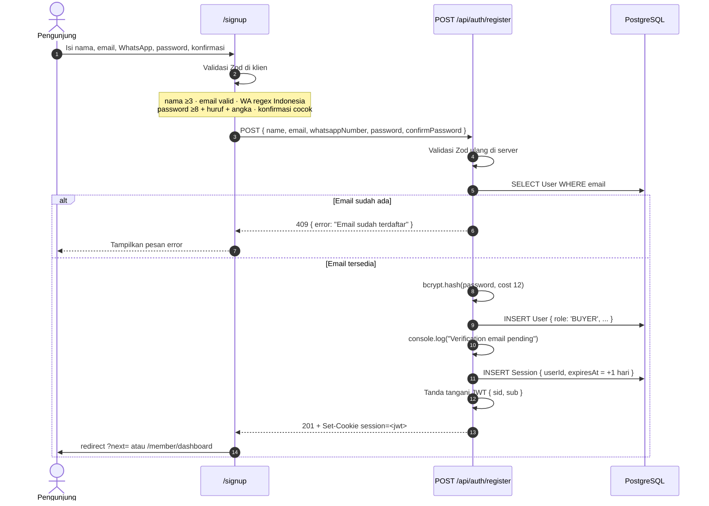
```mermaid
sequenceDiagram
    autonumber
    actor U as Pengunjung
    participant P as /signup
    participant A as POST /api/auth/register
    participant DB as PostgreSQL

    U->>P: Isi nama, email, WhatsApp, password, konfirmasi
    P->>P: Validasi Zod di klien
    Note over P: nama ≥3 · email valid · WA regex Indonesia<br/>password ≥8 + huruf + angka · konfirmasi cocok
    P->>A: POST { name, email, whatsappNumber, password, confirmPassword }
    A->>A: Validasi Zod ulang di server
    A->>DB: SELECT User WHERE email
    alt Email sudah ada
        A-->>P: 409 { error: "Email sudah terdaftar" }
        P-->>U: Tampilkan pesan error
    else Email tersedia
        A->>A: bcrypt.hash(password, cost 12)
        A->>DB: INSERT User { role: 'BUYER', ... }
        A->>A: console.log("Verification email pending")
        A->>DB: INSERT Session { userId, expiresAt = +1 hari }
        A->>A: Tanda tangani JWT { sid, sub }
        A-->>P: 201 + Set-Cookie session=<jwt>
        P->>U: redirect ?next= atau /member/dashboard
    end
```

Semua pendaftar mendapat `role = 'BUYER'`. Registrasi **langsung membuat sesi** (auto-login) — tidak ada langkah verifikasi email yang memblokir. Kolom `User.emailVerifiedAt` disiapkan di skema tetapi belum diisi oleh alur mana pun.

### 1.2 Login member vs login admin

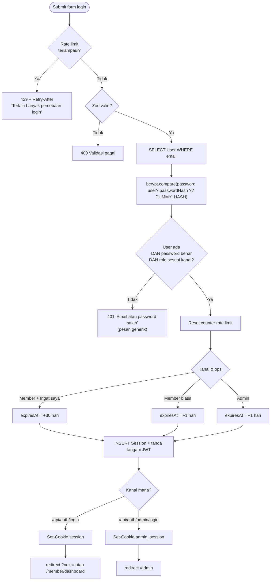
```mermaid
flowchart TD
    S([Submit form login]) --> RL{Rate limit<br/>terlampaui?}
    RL -->|Ya| E429["429 + Retry-After<br/>'Terlalu banyak percobaan login'"]
    RL -->|Tidak| VZ{Zod valid?}
    VZ -->|Tidak| E400["400 Validasi gagal"]
    VZ -->|Ya| FU[SELECT User WHERE email]
    FU --> CMP["bcrypt.compare(password,<br/>user?.passwordHash ?? DUMMY_HASH)"]
    CMP --> CHK{User ada<br/>DAN password benar<br/>DAN role sesuai kanal?}
    CHK -->|Tidak| E401["401 'Email atau password salah'<br/>(pesan generik)"]
    CHK -->|Ya| RST[Reset counter rate limit]
    RST --> DUR{Kanal & opsi}
    DUR -->|Member + Ingat saya| D30[expiresAt = +30 hari]
    DUR -->|Member biasa| D1[expiresAt = +1 hari]
    DUR -->|Admin| DA[expiresAt = +1 hari]
    D30 --> INS
    D1 --> INS
    DA --> INS[INSERT Session + tanda tangani JWT]
    INS --> CK{Kanal mana?}
    CK -->|/api/auth/login| C1["Set-Cookie session"]
    CK -->|/api/auth/admin/login| C2["Set-Cookie admin_session"]
    C1 --> R1[redirect ?next= atau /member/dashboard]
    C2 --> R2[redirect /admin]
```

Aturan penolakan berdasarkan role:

| Endpoint                     | Menolak            | Alasan                                   |
| ---------------------------- | ------------------ | ---------------------------------------- |
| `POST /api/auth/login`       | `role === 'ADMIN'` | Admin tidak boleh punya cookie sesi toko |
| `POST /api/auth/admin/login` | `role !== 'ADMIN'` | Member biasa tidak boleh masuk panel     |

Keduanya membalas pesan **identik** ("Email atau password salah") agar tidak membocorkan bahwa suatu email adalah akun admin.

### 1.3 Verifikasi sesi pada setiap request

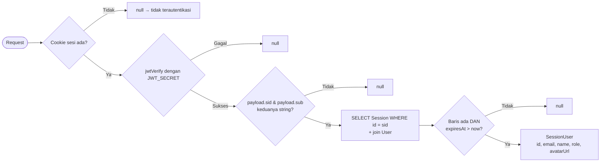
```mermaid
flowchart LR
    R([Request]) --> CK{Cookie sesi ada?}
    CK -->|Tidak| N1[null → tidak terautentikasi]
    CK -->|Ya| JV{jwtVerify dengan JWT_SECRET}
    JV -->|Gagal| N2[null]
    JV -->|Sukses| PL{payload.sid & payload.sub<br/>keduanya string?}
    PL -->|Tidak| N3[null]
    PL -->|Ya| Q[SELECT Session WHERE id = sid<br/>+ join User]
    Q --> EX{Baris ada DAN<br/>expiresAt > now?}
    EX -->|Tidak| N4[null]
    EX -->|Ya| OK[SessionUser<br/>id, email, name, role, avatarUrl]
```

Karena setiap verifikasi menyentuh database, **menghapus baris `Session` langsung mencabut akses** meskipun JWT-nya masih valid secara kriptografis. Ini dipakai pada logout dan pada reset password (yang menghapus semua sesi user).

### 1.4 Logout

```
POST /api/auth/logout           (atau /api/auth/admin/logout)
  ├─ Baca cookie → verifikasi token → ambil sid
  ├─ DELETE FROM Session WHERE id = sid     (deleteMany, jadi idempoten)
  └─ 204 + Set-Cookie <nama>='' dengan expires = epoch
```

Aman dipanggil berulang atau tanpa sesi — tidak pernah error.

---

## 2. Flow Lupa & Reset Password

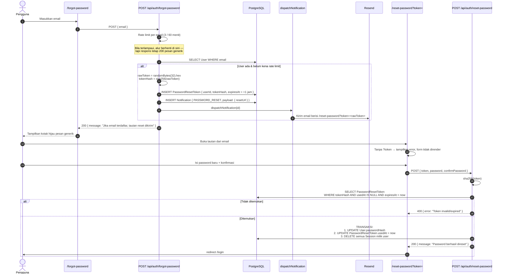
```mermaid
sequenceDiagram
    autonumber
    actor U as Pengguna
    participant F as /forgot-password
    participant A1 as POST /api/auth/forgot-password
    participant DB as PostgreSQL
    participant N as dispatchNotification
    participant R as Resend
    participant P as /reset-password?token=
    participant A2 as POST /api/auth/reset-password

    U->>F: Masukkan email
    F->>A1: POST { email }
    A1->>A1: Rate limit per email (3 / 60 menit)
    Note over A1: Bila terlampaui, alur berhenti di sini —<br/>tapi respons tetap 200 pesan generik
    A1->>DB: SELECT User WHERE email
    alt User ada & belum kena rate limit
        A1->>A1: rawToken = randomBytes(32).hex<br/>tokenHash = sha256(rawToken)
        A1->>DB: INSERT PasswordResetToken { userId, tokenHash, expiresAt = +1 jam }
        A1->>DB: INSERT Notification { PASSWORD_RESET, payload: { resetUrl } }
        A1->>N: dispatchNotification(id)
        N->>R: Kirim email berisi /reset-password?token=<rawToken>
    end
    A1-->>F: 200 { message: "Jika email terdaftar, tautan reset dikirim" }
    F-->>U: Tampilkan kotak hijau pesan generik

    U->>P: Buka tautan dari email
    P->>P: Tanpa ?token → tampilkan error, form tidak dirender
    U->>P: Isi password baru + konfirmasi
    P->>A2: POST { token, password, confirmPassword }
    A2->>A2: sha256(token)
    A2->>DB: SELECT PasswordResetToken<br/>WHERE tokenHash AND usedAt IS NULL AND expiresAt > now
    alt Tidak ditemukan
        A2-->>P: 400 { error: "Token invalid/expired" }
    else Ditemukan
        A2->>DB: TRANSAKSI:<br/>1. UPDATE User.passwordHash<br/>2. UPDATE PasswordResetToken.usedAt = now<br/>3. DELETE semua Session milik user
        A2-->>P: 200 { message: "Password berhasil direset" }
        P->>U: redirect /login
    end
```

Poin desain penting:

| Aspek                       | Keputusan                                                                                     |
| --------------------------- | --------------------------------------------------------------------------------------------- |
| Token disimpan sebagai hash | Kebocoran tabel tidak memberi penyerang token yang bisa dipakai                               |
| Respons selalu generik      | Tidak bisa dipakai untuk menebak email mana yang terdaftar                                    |
| Rate limit per **email**    | Berbeda dari login yang per IP — mencegah spam ke satu korban                                 |
| TTL 1 jam & sekali pakai    | `usedAt` mencegah token dipakai dua kali                                                      |
| Semua sesi dihapus          | Bila akun sedang dibajak, reset password langsung mengeluarkan penyerang dari semua perangkat |

Admin juga bisa memicu alur ini dari **Admin → Member → Reset Password** (`POST /api/admin/members/[id]/reset-password`), yang membuat token identik dan mengirim email yang sama. Admin tidak pernah melihat token atau password.

---

## 3. Flow Keranjang

### 3.1 Bagaimana keranjang ditemukan (`resolveCart`)

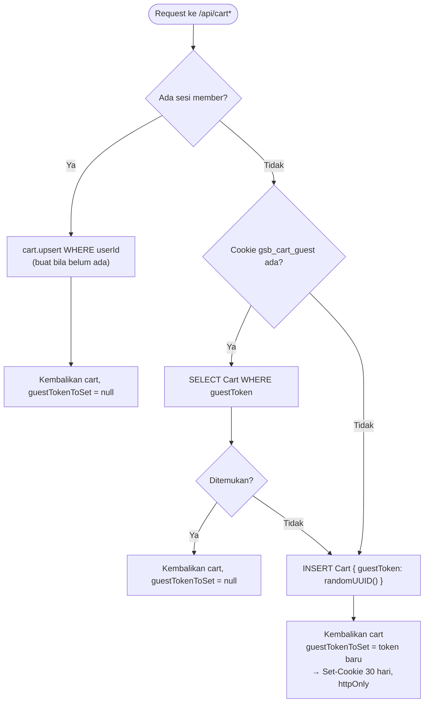
```mermaid
flowchart TD
    R([Request ke /api/cart*]) --> S{Ada sesi member?}
    S -->|Ya| U["cart.upsert WHERE userId<br/>(buat bila belum ada)"]
    U --> RET1[Kembalikan cart, guestTokenToSet = null]
    S -->|Tidak| C{Cookie gsb_cart_guest ada?}
    C -->|Ya| F[SELECT Cart WHERE guestToken]
    F --> FE{Ditemukan?}
    FE -->|Ya| RET2[Kembalikan cart, guestTokenToSet = null]
    FE -->|Tidak| NEW
    C -->|Tidak| NEW["INSERT Cart { guestToken: randomUUID() }"]
    NEW --> RET3["Kembalikan cart<br/>guestTokenToSet = token baru<br/>→ Set-Cookie 30 hari, httpOnly"]
```

Constraint database menjaga invariannya: `Cart.userId` dan `Cart.guestToken` keduanya `@unique`, jadi satu member hanya bisa punya satu keranjang, dan satu token guest hanya menunjuk satu keranjang.

Setiap route keranjang memakai helper `withGuestCookie()` sehingga cookie baru selalu ikut dikirim — **termasuk pada respons error**. Tanpa ini, guest yang gagal menambah item (mis. stok kurang) akan kehilangan keranjangnya di request berikutnya.

### 3.2 Tambah item

```
POST /api/cart/items  { productId, quantity }
  ├─ Zod: productId UUID, quantity integer > 0
  ├─ SELECT Product; tidak ada ATAU isActive = false → 404 "Produk tidak ditemukan"
  ├─ resolveCart
  ├─ Cari CartItem existing (unique cartId+productId)
  ├─ newQuantity = (existing?.quantity ?? 0) + quantity
  ├─ product.stock < newQuantity → 400 { issues: { quantity: ["Stok tidak mencukupi"] } }
  ├─ UPSERT CartItem { quantity: newQuantity, priceSnapshot: product.finalPrice }
  └─ 201 dengan seluruh keranjang ter-serialize
```

Perhatikan bahwa cek stok memakai **kuantitas akumulatif**, bukan kuantitas yang dikirim — jadi menambahkan 1 sepuluh kali tidak bisa melewati batas stok.

`priceSnapshot` hanya di-set saat baris **dibuat**. Saat kuantitas ditambah pada baris yang sudah ada, snapshot lama dipertahankan; inilah yang memunculkan flag `price_changed` di halaman keranjang bila harga produk berubah.

### 3.3 Ubah kuantitas & hapus

```
PATCH /api/cart/items/[itemId]  { quantity }   (minimal 1)
  ├─ Item tidak ada ATAU item.cartId !== cart.id → 404
  ├─ product.stock < quantity → 400 "Stok tidak mencukupi"
  └─ UPDATE quantity → kembalikan keranjang lengkap

DELETE /api/cart/items/[itemId]
  ├─ Item tidak ada ATAU bukan milik keranjang ini → 404
  └─ DELETE → kembalikan keranjang lengkap
```

Cek `item.cartId !== cart.id` adalah pengaman kepemilikan: seseorang tidak bisa memanipulasi item di keranjang orang lain hanya dengan menebak `itemId`.

Kedua endpoint mengembalikan **seluruh keranjang yang sudah diserialisasi**, bukan hanya item yang diubah, sehingga klien tidak perlu request kedua untuk memperbarui subtotal dan badge.

### 3.4 Serialisasi & flag

`serializeCart(cart)` menghitung per item:

```
flag = (!product.isActive || product.stock < item.quantity)  ? 'out_of_stock'
     : (product.finalPrice !== item.priceSnapshot)           ? 'price_changed'
     : null

lineTotal = priceSnapshot × quantity
subtotal  = Σ lineTotal
itemCount = Σ quantity
```

`out_of_stock` **memblokir** tombol checkout di halaman keranjang. `price_changed` hanya informatif.

### 3.5 Penggabungan keranjang guest → member

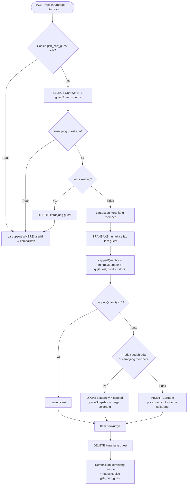
```mermaid
flowchart TD
    P([POST /api/cart/merge — butuh sesi]) --> G{Cookie gsb_cart_guest ada?}
    G -->|Tidak| UP[cart.upsert WHERE userId → kembalikan]
    G -->|Ya| FG[SELECT Cart WHERE guestToken + items]
    FG --> EX{Keranjang guest ada?}
    EX -->|Tidak| UP
    EX -->|Ya| EMP{items kosong?}
    EMP -->|Ya| DEL[DELETE keranjang guest] --> UP
    EMP -->|Tidak| MC[cart.upsert keranjang member]
    MC --> TX[TRANSAKSI: untuk setiap item guest]
    TX --> CAP["cappedQuantity = min(qtyMember + qtyGuest, product.stock)"]
    CAP --> Z{cappedQuantity ≤ 0?}
    Z -->|Ya| SKIP[Lewati item] --> NX
    Z -->|Tidak| E2{Produk sudah ada<br/>di keranjang member?}
    E2 -->|Ya| UPD["UPDATE quantity = capped<br/>priceSnapshot = harga sekarang"]
    E2 -->|Tidak| CRT["INSERT CartItem<br/>priceSnapshot = harga sekarang"]
    UPD --> NX
    CRT --> NX[Item berikutnya]
    NX --> DG[DELETE keranjang guest] --> RES["Kembalikan keranjang member<br/>+ hapus cookie gsb_cart_guest"]
```

Aturan penggabungan: kuantitas **dijumlahkan** lalu **dibatasi stok yang tersedia**, dan `priceSnapshot` **disegarkan** ke harga terkini (sehingga tidak ada flag `price_changed` palsu tepat setelah merge).

> ⚠️ **Endpoint ini belum dipanggil dari mana pun.** Halaman `/login` dan `/signup` tidak memanggil `POST /api/cart/merge`, sehingga guest yang punya item lalu login akan melihat keranjang member (yang biasanya kosong) dan kehilangan pilihan sebelumnya secara visual — item guest tetap ada di database tetapi tidak lagi terhubung. Memanggil endpoint ini setelah login sukses menutup celah itu.

---

## 4. Flow Checkout & Pembuatan Pesanan

### 4.1 Gambaran besar

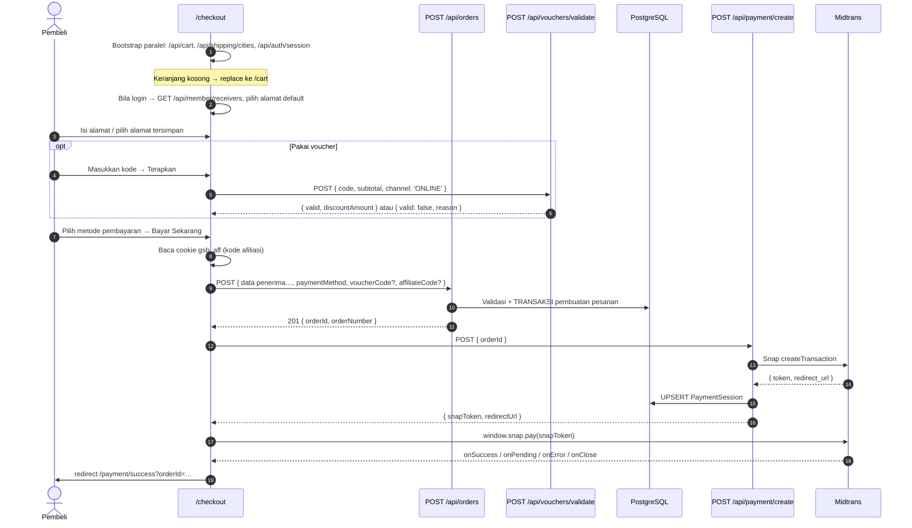
```mermaid
sequenceDiagram
    autonumber
    actor U as Pembeli
    participant C as /checkout
    participant O as POST /api/orders
    participant V as POST /api/vouchers/validate
    participant DB as PostgreSQL
    participant PY as POST /api/payment/create
    participant M as Midtrans

    C->>C: Bootstrap paralel: /api/cart, /api/shipping/cities, /api/auth/session
    Note over C: Keranjang kosong → replace ke /cart
    C->>C: Bila login → GET /api/member/receivers, pilih alamat default
    U->>C: Isi alamat / pilih alamat tersimpan
    opt Pakai voucher
        U->>C: Masukkan kode → Terapkan
        C->>V: POST { code, subtotal, channel: 'ONLINE' }
        V-->>C: { valid, discountAmount } atau { valid: false, reason }
    end
    U->>C: Pilih metode pembayaran → Bayar Sekarang
    C->>C: Baca cookie gsb_aff (kode afiliasi)
    C->>O: POST { data penerima…, paymentMethod, voucherCode?, affiliateCode? }
    O->>DB: Validasi + TRANSAKSI pembuatan pesanan
    O-->>C: 201 { orderId, orderNumber }
    C->>PY: POST { orderId }
    PY->>M: Snap createTransaction
    M-->>PY: { token, redirect_url }
    PY->>DB: UPSERT PaymentSession
    PY-->>C: { snapToken, redirectUrl }
    C->>M: window.snap.pay(snapToken)
    M-->>C: onSuccess / onPending / onError / onClose
    C->>U: redirect /payment/success?orderId=…
```

### 4.2 Detail validasi & transaksi `POST /api/orders`

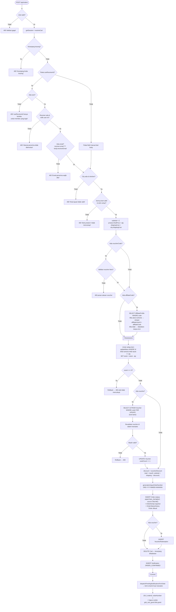
```mermaid
flowchart TD
    A([POST /api/orders]) --> Z{Zod valid?}
    Z -->|Tidak| E1[400 Validasi gagal]
    Z -->|Ya| SE[getSession + resolveCart]
    SE --> CE{Keranjang kosong?}
    CE -->|Ya| E2[400 'Keranjang Anda kosong']
    CE -->|Tidak| MD{Pakai useReceiverId?}

    MD -->|Ya| L1{Ada sesi?}
    L1 -->|Tidak| E3[400 'useReceiverId hanya berlaku<br/>untuk member yang login']
    L1 -->|Ya| L2{Receiver ada &<br/>milik user ini?}
    L2 -->|Tidak| E4[400 'Alamat penerima tidak ditemukan']
    L2 -->|Ya| L3{Ada email?<br/>receiver.email ?? body.receiverEmail}
    L3 -->|Tidak| E5[400 'Email penerima wajib diisi']
    L3 -->|Ya| CITY
    MD -->|Tidak| MAN[Pakai field manual dari body] --> CITY

    CITY{City ada & isActive?} -->|Tidak| E6[400 'Kota tujuan tidak valid']
    CITY -->|Ya| STK{Semua item aktif<br/>& stok cukup?}
    STK -->|Tidak| E7["400 'Stok produk X tidak mencukupi'"]
    STK -->|Ya| CALC["subtotal = Σ product.finalPrice × qty<br/>shippingCost = city.shippingCost"]
    CALC --> VPRE{Ada voucherCode?}
    VPRE -->|Ya| VV{Validasi voucher lolos?}
    VV -->|Tidak| E8[400 pesan alasan voucher]
    VV -->|Ya| AFF
    VPRE -->|Tidak| AFF{Ada affiliateCode?}
    AFF -->|Ya| AL["SELECT AffiliateProfile WHERE code<br/>Bila ada & isActive → simpan<br/>affiliateUserId + affiliateCode<br/>Bila tidak → diabaikan tanpa error"]
    AFF -->|Tidak| TX
    AL --> TX

    TX[["TRANSAKSI"]] --> T1["Untuk setiap item:<br/>updateMany WHERE id AND isActive AND stock >= qty<br/>SET stock = stock - qty"]
    T1 --> T1C{count === 0?}
    T1C -->|Ya| E9[Rollback → 400 stok tidak mencukupi]
    T1C -->|Tidak| T2{Ada voucher?}
    T2 -->|Ya| T2A["SELECT id FROM Voucher WHERE code FOR UPDATE<br/>(lock baris)"]
    T2A --> T2B[Revalidasi voucher di dalam transaksi]
    T2B --> T2C{Masih valid?}
    T2C -->|Tidak| E10[Rollback → 400]
    T2C -->|Ya| T2D[UPDATE Voucher usedCount += 1]
    T2D --> T3
    T2 -->|Tidak| T3["discount = voucherDiscount<br/>total = max(0, subtotal + shipping − discount)"]
    T3 --> T4[generateUniqueOrderNumber<br/>ORD-YYYYMMDD-NNNNNN]
    T4 --> T5["INSERT Order (status AWAITING_PAYMENT, source ONLINE)<br/>+ OrderItem[] snapshot<br/>+ OrderStatusHistory 'Order dibuat'"]
    T5 --> T6{Ada voucher?}
    T6 -->|Ya| T7[INSERT VoucherRedemption]
    T6 -->|Tidak| T8
    T7 --> T8[DELETE Cart — keranjang dihabiskan]
    T8 --> T9["INSERT Notification ORDER_CONFIRMED"]
    T9 --> CM[[Commit]]
    CM --> DSP[dispatchPendingNotificationsForOrder<br/>→ kirim email di luar transaksi]
    DSP --> R201["201 { orderId, orderNumber }<br/>+ hapus cookie gsb_cart_guest bila guest"]
```

### 4.3 Aturan yang perlu dipahami

| Aturan                                            | Alasan                                                                                                                     |
| ------------------------------------------------- | -------------------------------------------------------------------------------------------------------------------------- |
| **Harga diambil ulang dari `product.finalPrice`** | Bukan dari `CartItem.priceSnapshot`. Klien tidak bisa memaksa harga lama/lebih murah                                       |
| **Ongkir dari `city.shippingCost`**               | Klien tidak mengirim nominal ongkir sama sekali                                                                            |
| **Voucher divalidasi dua kali**                   | Sekali di luar transaksi (gagal cepat, hemat), sekali **di dalam** transaksi setelah row lock (benar)                      |
| **`SELECT … FOR UPDATE` pada voucher**            | Mencegah dua pesanan bersamaan menembus kuota terakhir                                                                     |
| **`updateMany` bersyarat + cek `count === 0`**    | Pengurangan stok atomik. Dua pembeli yang berebut item terakhir: satu berhasil, satu dapat error stok                      |
| **Kode afiliasi tidak valid diabaikan diam-diam** | Pesanan tidak boleh gagal hanya karena atribusi marketing salah                                                            |
| **`Cart` dihapus, bukan dikosongkan**             | Guest mendapat keranjang baru pada request berikutnya; cookie lama dihapus dari respons                                    |
| **Snapshot pada `OrderItem`**                     | `titleSnapshot`, `priceSnapshot`, `discountPercentSnapshot` membuat pesanan lama tetap akurat walau produk berubah/dihapus |
| **Notifikasi dikirim setelah commit**             | Kegagalan kirim email tidak boleh me-rollback pesanan yang sudah sah                                                       |
| **`receiverCity` disimpan sebagai nama teks**     | Bukan FK. Kota yang di-rename/dihapus tidak mengubah pesanan historis                                                      |

### 4.4 Format nomor pesanan

```
ORD-20260812-483920
     ^tanggal   ^6 digit acak (randomInt kriptografis)
```

`generateUniqueOrderNumber` mengulang pembuatan sampai tidak bentrok (dicek terhadap unique constraint `Order.orderNumber`). Dipakai juga oleh POS.

### 4.5 Guest checkout

Guest bisa checkout penuh: `Order.userId` bernilai `null`. Konsekuensinya:

- Pesanan tidak muncul di `/member/transaksi` mana pun
- Satu-satunya cara pembeli mengaksesnya adalah `orderId` (UUID) yang ia terima di halaman `/payment/success` setelah checkout, plus email konfirmasi
- Endpoint `payment/create` dan `payment/status` mengizinkan akses tanpa sesi selama `order.userId === null`
- Tidak ada mekanisme "klaim pesanan guest ke akun" setelah mendaftar

---

## 5. Flow Pembayaran (Midtrans Snap)

### 5.1 Membuat sesi pembayaran

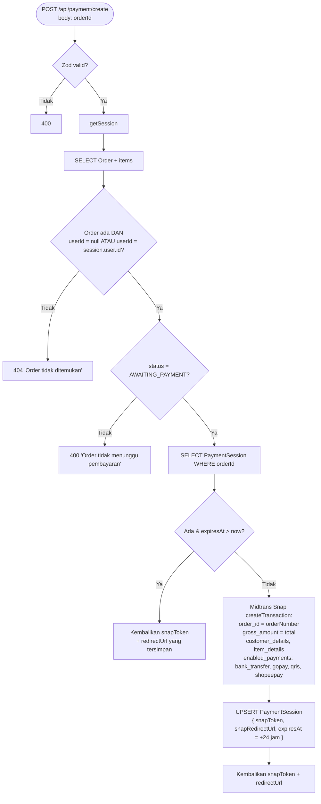
```mermaid
flowchart TD
    A([POST /api/payment/create<br/>body: orderId]) --> Z{Zod valid?}
    Z -->|Tidak| E1[400]
    Z -->|Ya| G[getSession]
    G --> F[SELECT Order + items]
    F --> OWN{Order ada DAN<br/>userId = null ATAU userId = session.user.id?}
    OWN -->|Tidak| E2[404 'Order tidak ditemukan']
    OWN -->|Ya| ST{status = AWAITING_PAYMENT?}
    ST -->|Tidak| E3[400 'Order tidak menunggu pembayaran']
    ST -->|Ya| PS[SELECT PaymentSession WHERE orderId]
    PS --> CACHE{Ada & expiresAt > now?}
    CACHE -->|Ya| RET1["Kembalikan snapToken<br/>+ redirectUrl yang tersimpan"]
    CACHE -->|Tidak| SNAP["Midtrans Snap createTransaction:<br/>order_id = orderNumber<br/>gross_amount = total<br/>customer_details, item_details<br/>enabled_payments: bank_transfer, gopay, qris, shopeepay"]
    SNAP --> UP["UPSERT PaymentSession<br/>{ snapToken, snapRedirectUrl, expiresAt = +24 jam }"]
    UP --> RET2[Kembalikan snapToken + redirectUrl]
```

Perhatikan bahwa Midtrans menerima **`orderNumber`** (bukan UUID) sebagai `order_id`. Inilah sebabnya webhook mencari pesanan dengan `where: { orderNumber: data.order_id }`.

Cache 24 jam berarti pengguna yang menutup popup lalu kembali akan mendapat token yang sama, bukan transaksi Midtrans baru.

### 5.2 Webhook (jalur utama pemastian pembayaran)

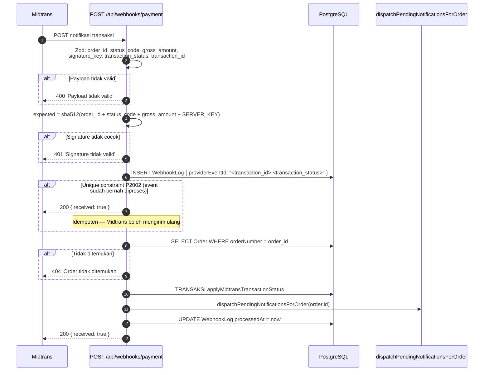
```mermaid
sequenceDiagram
    autonumber
    participant M as Midtrans
    participant W as POST /api/webhooks/payment
    participant DB as PostgreSQL
    participant N as dispatchPendingNotificationsForOrder

    M->>W: POST notifikasi transaksi
    W->>W: Zod: order_id, status_code, gross_amount,<br/>signature_key, transaction_status, transaction_id
    alt Payload tidak valid
        W-->>M: 400 'Payload tidak valid'
    end
    W->>W: expected = sha512(order_id + status_code + gross_amount + SERVER_KEY)
    alt Signature tidak cocok
        W-->>M: 401 'Signature tidak valid'
    end
    W->>DB: INSERT WebhookLog { providerEventId: "<transaction_id>:<transaction_status>" }
    alt Unique constraint P2002 (event sudah pernah diproses)
        W-->>M: 200 { received: true }
        Note over W: Idempoten — Midtrans boleh mengirim ulang
    end
    W->>DB: SELECT Order WHERE orderNumber = order_id
    alt Tidak ditemukan
        W-->>M: 404 'Order tidak ditemukan'
    end
    W->>DB: TRANSAKSI applyMidtransTransactionStatus
    W->>N: dispatchPendingNotificationsForOrder(order.id)
    W->>DB: UPDATE WebhookLog.processedAt = now
    W-->>M: 200 { received: true }
```

### 5.3 Pemetaan status Midtrans → status pesanan

`applyMidtransTransactionStatus` (`src/server/payment/apply-status.ts`):

```
1. SELALU: UPDATE PaymentSession SET lastTransactionStatus = transactionStatus
           (+ vaNumber bila dikirim)

2. Bila order.status !== 'AWAITING_PAYMENT' → berhenti
   (pesanan yang sudah lanjut tidak boleh diubah webhook yang datang terlambat)

3. transactionStatus ∈ { settlement, capture } DAN fraudStatus !== 'deny'
     → applyOrderStatusTransition(→ PAID)

4. transactionStatus ∈ { deny, cancel, expire, failure } ATAU fraudStatus === 'deny'
     → applyOrderStatusTransition(→ CANCELLED)

5. Status lain (mis. 'pending') → tidak ada perubahan status pesanan
```

Langkah 2 penting: bila pesanan sudah `PACKED` lalu webhook `settlement` datang lagi, tidak terjadi apa-apa (transisi `PACKED → PAID` juga tidak sah di state machine).

### 5.4 Polling status (fallback)

`GET /api/payment/status/[orderId]` — dipakai bila webhook tidak sampai (mis. localhost tanpa tunnel):

```
├─ Cek kepemilikan (sama seperti payment/create)
├─ Bila status masih AWAITING_PAYMENT:
│    ├─ Midtrans CoreApi transaction.status(orderNumber)   ← .catch(() => null)
│    └─ Bila berhasil → applyMidtransTransactionStatus dalam transaksi
└─ Kembalikan { orderStatus, transactionStatus, vaNumber, expireAt }
```

Endpoint ini menjadikan status Midtrans sebagai sumber kebenaran dan menerapkan efek yang sama dengan webhook. **Belum dipakai oleh halaman mana pun** — halaman `/payment/success` hanya membaca status dari database sekali saat render.

### 5.5 Penanganan kegagalan di sisi klien checkout

| Kegagalan                               | Perilaku                                                                                                                                          |
| --------------------------------------- | ------------------------------------------------------------------------------------------------------------------------------------------------- |
| `POST /api/orders` gagal                | Pesan error di panel ringkasan; pesanan tidak dibuat; keranjang tetap utuh                                                                        |
| `POST /api/payment/create` gagal        | **Tetap redirect** ke `/payment/success?orderId=…` — pesanan sudah sah, hanya sesi pembayaran gagal. Pengguna melihat state "Menunggu Pembayaran" |
| Script `snap.js` gagal dimuat           | `snapFailedRef = true` → `window.location.href = redirectUrl` (halaman Snap penuh, bukan popup)                                                   |
| `window.snap` tidak ada                 | Sama seperti di atas                                                                                                                              |
| Popup Snap ditutup pengguna (`onClose`) | Redirect ke `/payment/success` — halaman menampilkan "Menunggu Pembayaran"                                                                        |
| `onError` dari Snap                     | Redirect ke halaman yang sama; status sebenarnya ditentukan database/webhook                                                                      |

Prinsipnya: **halaman hasil selalu menampilkan kondisi dari database**, bukan menyimpulkan dari callback klien yang tidak bisa dipercaya.

---

## 6. Flow Siklus Status Pesanan

### 6.1 State machine

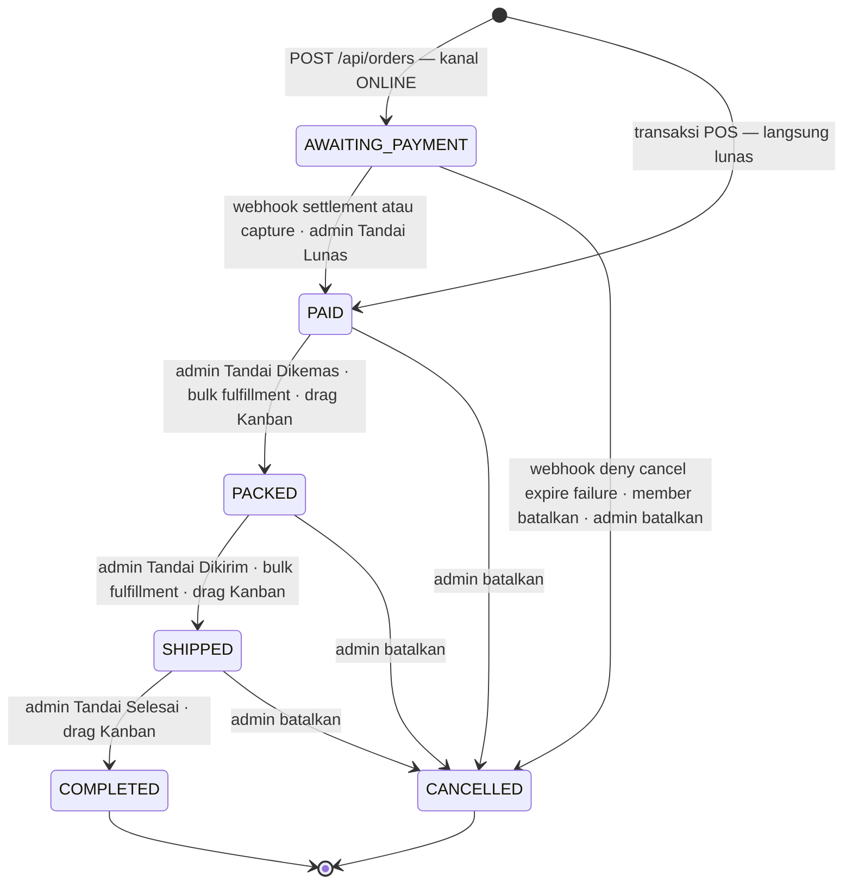
```mermaid
stateDiagram-v2
    [*] --> AWAITING_PAYMENT : POST /api/orders — kanal ONLINE
    [*] --> PAID : transaksi POS — langsung lunas

    AWAITING_PAYMENT --> PAID : webhook settlement atau capture · admin Tandai Lunas
    AWAITING_PAYMENT --> CANCELLED : webhook deny cancel expire failure · member batalkan · admin batalkan

    PAID --> PACKED : admin Tandai Dikemas · bulk fulfillment · drag Kanban
    PAID --> CANCELLED : admin batalkan

    PACKED --> SHIPPED : admin Tandai Dikirim · bulk fulfillment · drag Kanban
    PACKED --> CANCELLED : admin batalkan

    SHIPPED --> COMPLETED : admin Tandai Selesai · drag Kanban
    SHIPPED --> CANCELLED : admin batalkan

    COMPLETED --> [*]
    CANCELLED --> [*]
```

Tabel transisi yang sah (`ORDER_STATUS_TRANSITIONS` di `src/server/orders/status.ts`):

| Dari               | Boleh ke                 |
| ------------------ | ------------------------ |
| `AWAITING_PAYMENT` | `PAID`, `CANCELLED`      |
| `PAID`             | `PACKED`, `CANCELLED`    |
| `PACKED`           | `SHIPPED`, `CANCELLED`   |
| `SHIPPED`          | `COMPLETED`, `CANCELLED` |
| `COMPLETED`        | — (terminal)             |
| `CANCELLED`        | — (terminal)             |

Transisi tidak sah → `OrderStatusTransitionError` → `400 { "error": "Transisi status dari X ke Y tidak diizinkan" }`.

Tabel yang sama diduplikasi di klien (`NEXT_STATUS_OPTIONS` di `OrderDetailModal`, `VALID_TRANSITIONS` di halaman Board) agar UI hanya menampilkan tombol yang sah dan drag yang tidak valid ditolak instan. Server tetap otoritas final.

### 6.2 Apa yang terjadi pada setiap transisi

`applyOrderStatusTransition(tx, order, toStatus, { note, changedByUserId })`:

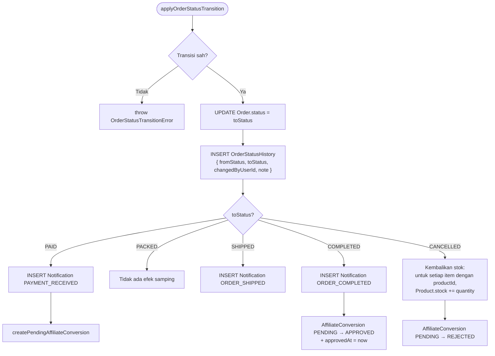
```mermaid
flowchart TD
    A([applyOrderStatusTransition]) --> V{Transisi sah?}
    V -->|Tidak| E[throw OrderStatusTransitionError]
    V -->|Ya| U1[UPDATE Order.status = toStatus]
    U1 --> U2["INSERT OrderStatusHistory<br/>{ fromStatus, toStatus, changedByUserId, note }"]
    U2 --> SW{toStatus?}

    SW -->|PAID| P1[INSERT Notification PAYMENT_RECEIVED]
    P1 --> P2[createPendingAffiliateConversion]

    SW -->|PACKED| NOP[Tidak ada efek samping]

    SW -->|SHIPPED| S1[INSERT Notification ORDER_SHIPPED]

    SW -->|COMPLETED| C1[INSERT Notification ORDER_COMPLETED]
    C1 --> C2["AffiliateConversion PENDING → APPROVED<br/>+ approvedAt = now"]

    SW -->|CANCELLED| X1["Kembalikan stok:<br/>untuk setiap item dengan productId,<br/>Product.stock += quantity"]
    X1 --> X2["AffiliateConversion PENDING → REJECTED"]
```

Semua ini berjalan **di dalam transaksi yang sama** dengan perubahan status, sehingga tidak mungkin ada status yang berubah tanpa riwayat, atau stok yang kembali tanpa pembatalan.

Catatan:

- Transisi ke `PACKED` sengaja tanpa efek samping. Enum `NotificationTemplate` punya nilai `ORDER_PACKED`, tetapi tidak ada kode yang mengantrekannya dan tidak ada renderer template untuknya.
- Pengembalian stok melewati item dengan `productId = null` (produk sudah dihapus permanen) — tidak ada yang bisa dikembalikan.
- Bila konversi afiliasi statusnya sudah bukan `PENDING`, langkah approve/reject dilewati (tidak menimpa `PAID`).

### 6.3 Siapa yang boleh memicu transisi

| Aksi                      | Aktor                          | Endpoint                              | Batasan                                                  |
| ------------------------- | ------------------------------ | ------------------------------------- | -------------------------------------------------------- |
| Batalkan pesanan sendiri  | Member                         | `POST /api/orders/[id]/cancel`        | Hanya miliknya, hanya dari `AWAITING_PAYMENT`            |
| Ubah status satu pesanan  | ADMIN                          | `PATCH /api/admin/orders/[id]/status` | Transisi harus sah                                       |
| Ubah status massal        | ADMIN                          | `POST /api/admin/orders/bulk-status`  | Maks 100 pesanan, per-pesanan bisa gagal parsial         |
| Drag Kanban               | ADMIN                          | (memakai endpoint status di atas)     | Divalidasi klien lalu server                             |
| Webhook pembayaran        | Midtrans                       | `POST /api/webhooks/payment`          | Hanya dari `AWAITING_PAYMENT`                            |
| Polling status pembayaran | siapa pun yang punya `orderId` | `GET /api/payment/status/[orderId]`   | Hanya dari `AWAITING_PAYMENT`, mengikuti status Midtrans |

`changedByUserId` diisi untuk aksi manusia (member/admin) dan **null** untuk perubahan dari webhook/polling — itulah cara membedakan perubahan otomatis dari perubahan manual di riwayat status.

---

## 7. Flow Afiliasi

### 7.1 Alur lengkap dari pendaftaran sampai payout


```mermaid
flowchart TD
    subgraph "A. Pendaftaran"
      A1[Member buka /member/afiliasi] --> A2{Punya AffiliateProfile?}
      A2 -->|Tidak| A3[Isi form bank → POST /api/affiliate/join]
      A3 --> A4["Generate kode unik<br/>6 char nama/email + 4 digit acak"]
      A4 --> A5["INSERT AffiliateProfile<br/>+ role BUYER → AFFILIATE<br/>+ Notification AFFILIATE_JOIN"]
      A2 -->|Ya| A6[Dashboard afiliasi]
      A5 --> A6
    end

    subgraph "B. Pilih produk"
      A6 --> B1["/member/afiliasi/produk"]
      B1 --> B2["PUT /api/affiliate/products<br/>DELETE semua lalu INSERT ulang"]
      B2 --> B3["Link tersedia:<br/>origin/r/KODE?p=slug"]
    end

    subgraph "C. Tracking klik"
      B3 --> C1[Calon pembeli klik link]
      C1 --> C2["GET /r/KODE?p=slug"]
      C2 --> C3{Profil ada & isActive?}
      C3 -->|Tidak| C4[Redirect saja, tanpa cookie] --> Z1([Produk/Beranda])
      C3 -->|Ya| C5["INSERT AffiliateClick<br/>(best-effort, .catch)"]
      C5 --> C6["Set gsb_cid 365 hari httpOnly<br/>Set gsb_aff 30 hari NON-httpOnly"]
      C6 --> Z1
    end

    subgraph "D. Atribusi saat checkout"
      Z1 --> D1[Pembeli belanja → /checkout]
      D1 --> D2["Klien baca document.cookie gsb_aff"]
      D2 --> D3["POST /api/orders { affiliateCode }"]
      D3 --> D4{Profil dengan kode itu<br/>ada & isActive?}
      D4 -->|Tidak| D5[Diabaikan — pesanan tetap dibuat] --> E1
      D4 -->|Ya| D6["Order.affiliateUserId + affiliateCode diisi"] --> E1
    end

    subgraph "E. Konversi & komisi"
      E1[Pesanan → PAID] --> E2{Order.affiliateUserId ada?}
      E2 -->|Tidak| Z2([Selesai, tanpa komisi])
      E2 -->|Ya| E3{AffiliateProfile ditemukan?}
      E3 -->|Tidak| Z2
      E3 -->|Ya| E4{Minimal 1 produk pesanan ada di<br/>AffiliateProductSelection afiliasi ini?}
      E4 -->|Tidak| Z2
      E4 -->|Ya| E5[Hitung commissionAmount]
      E5 --> E6["INSERT AffiliateConversion<br/>status PENDING"]
      E6 --> E7{Status pesanan lanjut ke?}
      E7 -->|COMPLETED| E8["APPROVED + approvedAt"]
      E7 -->|CANCELLED| E9["REJECTED"]
    end

    subgraph "F. Payout (API saja, belum ada UI)"
      E8 --> F1["POST /api/admin/affiliates/payouts<br/>{ affiliateProfileId, periodStart, periodEnd }"]
      F1 --> F2{Ada konversi APPROVED<br/>di periode itu?}
      F2 -->|Tidak| F3[400 'Tidak ada komisi APPROVED<br/>pada periode ini']
      F2 -->|Ya| F4["INSERT AffiliatePayout<br/>totalAmount = Σ komisi, status PENDING<br/>+ konversi tsb → PAID + paidAt"]
      F4 --> F5["PATCH /api/admin/affiliates/payouts/[id]<br/>→ status PAID + paidAt<br/>+ Notification AFFILIATE_PAYOUT"]
    end
```

### 7.2 Rumus perhitungan komisi

`computeCommissionAmount(tx, items)` di `src/server/orders/status.ts`:

```
defaultPercent = StoreSetting(id=1).defaultCommissionPercent   (0 bila baris belum ada)
total = 0

untuk setiap OrderItem:
  lewati bila productId null

  rate = AffiliateCommissionRate WHERE productId

  bila rate ADA:
      bila rate.isActive == false  → LEWATI item ini sepenuhnya
      bila rate.fixedAmount != null → total += rate.fixedAmount × quantity
      selain itu                    → total += floor(lineTotal × rate.percent / 100)
      lanjut ke item berikutnya

  bila rate TIDAK ADA:
      bila defaultPercent > 0 → total += floor(lineTotal × defaultPercent / 100)
```

Poin penting:

- **`fixedAmount` menang atas `percent`** bila keduanya terisi.
- **Tarif non-aktif berarti nol untuk item itu**, bukan jatuh ke tarif default. Menonaktifkan tarif adalah cara mengeluarkan produk dari program afiliasi.
- Tanpa baris tarif, `StoreSetting.defaultCommissionPercent` yang dipakai (default kolom = `5`). Karena `StoreSetting` **tidak diseed**, instalasi baru punya `defaultPercent = 0` sampai admin menyimpan Pengaturan.
- `floor` dipakai agar komisi tidak pernah melebihi persentase yang ditetapkan (pembulatan ke bawah, satuan rupiah).
- Komisi dihitung atas `lineTotal` (harga setelah diskon produk) dan **tidak** dikurangi diskon voucher atau ongkir.

### 7.3 Aturan kelayakan komisi

`isOrderEligibleForCommission` mensyaratkan **minimal satu** produk dalam pesanan ada di `AffiliateProductSelection` afiliasi tersebut.

Implikasi yang perlu dipahami: bila syarat terpenuhi, `computeCommissionAmount` menghitung komisi atas **seluruh** item pesanan, termasuk produk yang **tidak** dipilih afiliasi (selama produk itu punya tarif aktif atau ada `defaultCommissionPercent`). Jadi kelayakan bersifat per-pesanan (gerbang), bukan per-item.

### 7.4 Jendela atribusi

| Cookie    | Umur     | httpOnly  | Fungsi                                                                    |
| --------- | -------- | :-------: | ------------------------------------------------------------------------- |
| `gsb_aff` | 30 hari  | **Tidak** | Kode afiliasi. Dibaca **klien** di `/checkout` via `document.cookie`      |
| `gsb_cid` | 365 hari |    Ya     | ID pengunjung untuk deduplikasi/analisis klik (`AffiliateClick.cookieId`) |

`gsb_aff` sengaja tidak `httpOnly` — inilah kompromi desain yang memungkinkan halaman checkout (Client Component) menyertakan kode afiliasi tanpa endpoint tambahan. Risikonya kecil: nilainya hanya kode publik afiliasi, bukan kredensial.

Atribusi bersifat **last-click**: kunjungan lewat link afiliasi lain akan menimpa `gsb_aff`.

### 7.5 Status konversi

| Status     | Kapan                                            | Terhitung sebagai             |
| ---------- | ------------------------------------------------ | ----------------------------- |
| `PENDING`  | Pesanan mencapai `PAID` dan lolos kelayakan      | "Komisi Pending" di UI        |
| `APPROVED` | Pesanan mencapai `COMPLETED`                     | "Komisi Pending" di UI (juga) |
| `PAID`     | Dimasukkan ke `AffiliatePayout` (via API payout) | "Komisi Dibayar"              |
| `REJECTED` | Pesanan `CANCELLED`                              | tidak dihitung                |

Dari sudut pandang afiliasi, `PENDING` dan `APPROVED` sama-sama "belum masuk rekening", karena itu UI menggabungkannya sebagai "Komisi Pending".

---

## 8. Flow Voucher

### 8.1 Pipeline validasi

`validateVoucherCode(db, code, { subtotal, channel, userId })` — dievaluasi **berurutan**, berhenti di kegagalan pertama:

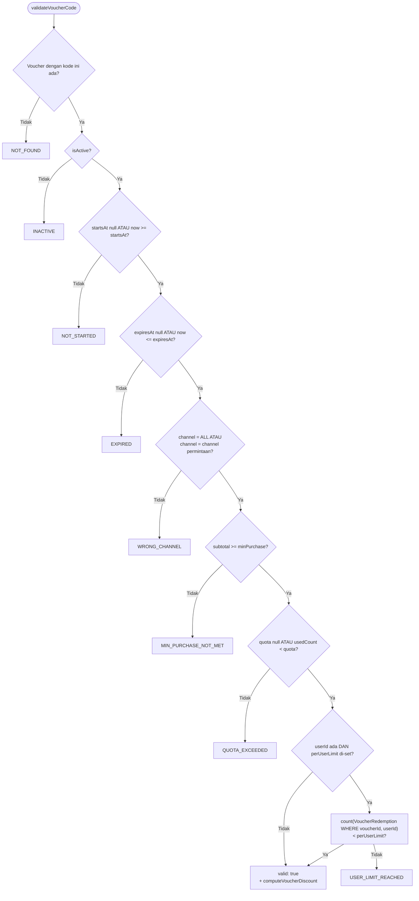
```mermaid
flowchart TD
    A([validateVoucherCode]) --> V1{Voucher dengan kode ini ada?}
    V1 -->|Tidak| R1[NOT_FOUND]
    V1 -->|Ya| V2{isActive?}
    V2 -->|Tidak| R2[INACTIVE]
    V2 -->|Ya| V3{startsAt null ATAU now >= startsAt?}
    V3 -->|Tidak| R3[NOT_STARTED]
    V3 -->|Ya| V4{expiresAt null ATAU now <= expiresAt?}
    V4 -->|Tidak| R4[EXPIRED]
    V4 -->|Ya| V5{channel = ALL ATAU<br/>channel = channel permintaan?}
    V5 -->|Tidak| R5[WRONG_CHANNEL]
    V5 -->|Ya| V6{subtotal >= minPurchase?}
    V6 -->|Tidak| R6[MIN_PURCHASE_NOT_MET]
    V6 -->|Ya| V7{quota null ATAU usedCount < quota?}
    V7 -->|Tidak| R7[QUOTA_EXCEEDED]
    V7 -->|Ya| V8{userId ada DAN perUserLimit di-set?}
    V8 -->|Tidak| OK
    V8 -->|Ya| V9["count(VoucherRedemption WHERE voucherId, userId)<br/>< perUserLimit?"]
    V9 -->|Tidak| R8[USER_LIMIT_REACHED]
    V9 -->|Ya| OK["valid: true<br/>+ computeVoucherDiscount"]
```

Perhatikan langkah V8: `perUserLimit` **hanya diperiksa bila ada `userId`**. Guest checkout dengan voucher berbatas per-pengguna tidak dibatasi, karena tidak ada identitas untuk dihitung.

### 8.2 Rumus diskon

```
rawDiscount = (type == PERCENT) ? floor(subtotal × value / 100)
                                : value                            // FIXED

cappedByMax = (maxDiscount != null) ? min(rawDiscount, maxDiscount) : rawDiscount

diskonAkhir = max(0, min(cappedByMax, subtotal))
```

Tiga lapis pembatas: persentase → `maxDiscount` → `subtotal`. Diskon tidak pernah melebihi subtotal, sehingga total tidak bisa negatif. Diskon dihitung atas **subtotal saja** — ongkir tidak pernah didiskon.

### 8.3 Titik pemakaian voucher

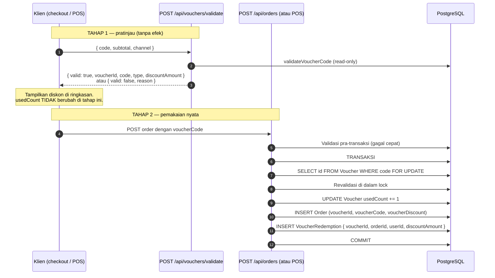
```mermaid
sequenceDiagram
    autonumber
    participant K as Klien (checkout / POS)
    participant V as POST /api/vouchers/validate
    participant O as POST /api/orders (atau POS)
    participant DB as PostgreSQL

    Note over K,V: TAHAP 1 — pratinjau (tanpa efek)
    K->>V: { code, subtotal, channel }
    V->>DB: validateVoucherCode (read-only)
    V-->>K: { valid: true, voucherId, code, type, discountAmount }<br/>atau { valid: false, reason }
    Note over K: Tampilkan diskon di ringkasan.<br/>usedCount TIDAK berubah di tahap ini.

    Note over K,O: TAHAP 2 — pemakaian nyata
    K->>O: POST order dengan voucherCode
    O->>DB: Validasi pra-transaksi (gagal cepat)
    O->>DB: TRANSAKSI
    O->>DB: SELECT id FROM Voucher WHERE code FOR UPDATE
    O->>DB: Revalidasi di dalam lock
    O->>DB: UPDATE Voucher usedCount += 1
    O->>DB: INSERT Order (voucherId, voucherCode, voucherDiscount)
    O->>DB: INSERT VoucherRedemption { voucherId, orderId, userId, discountAmount }
    O->>DB: COMMIT
```

Validasi berlapis ini menutup dua celah sekaligus:

1. **Waktu**: voucher bisa kedaluwarsa/kehabisan kuota antara pratinjau dan submit → revalidasi di dalam transaksi menangkapnya.
2. **Konkurensi**: dua pesanan bersamaan berebut kuota terakhir → row lock `FOR UPDATE` membuat salah satunya menunggu, lalu gagal validasi.

### 8.4 Pembatasan kanal

| `channel` voucher | Berlaku di checkout online | Berlaku di POS |
| ----------------- | :------------------------: | :------------: |
| `ALL`             |             ✅             |       ✅       |
| `ONLINE`          |             ✅             |       ❌       |
| `POS`             |             ❌             |       ✅       |

Halaman checkout selalu mengirim `channel: 'ONLINE'`; endpoint POS selalu memakai `channel: 'POS'`. Voucher POS tidak bisa dipakai pembeli online dan sebaliknya.

### 8.5 Aturan penghapusan voucher

```
DELETE /api/admin/vouchers/[id]
  ├─ usedCount > 0 → 409 "Voucher sudah pernah digunakan dan tidak bisa dihapus.
  │                        Nonaktifkan voucher ini sebagai gantinya."
  └─ usedCount = 0 → DELETE, 204
```

Ini melindungi jejak audit: `VoucherRedemption` memakai `onDelete: Cascade`, sehingga menghapus voucher yang pernah dipakai akan menghapus catatan penukarannya. Untuk menghentikan voucher yang sudah beredar, gunakan toggle **Nonaktifkan**.

---

## 9. Flow POS

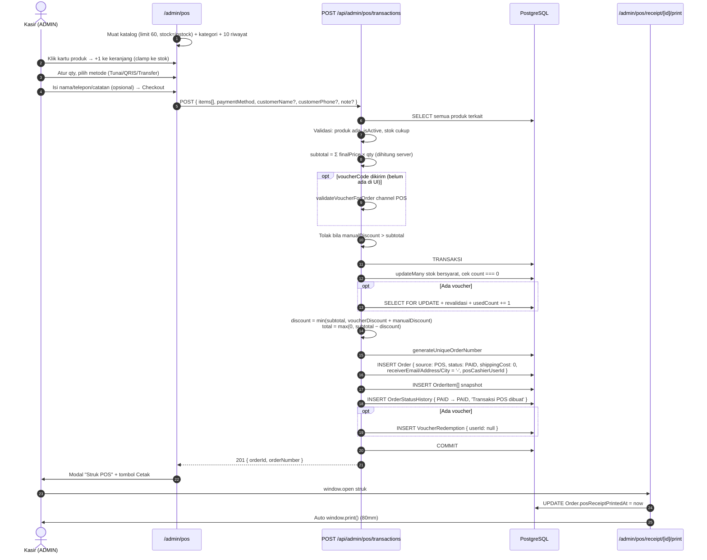
```mermaid
sequenceDiagram
    autonumber
    actor K as Kasir (ADMIN)
    participant P as /admin/pos
    participant A as POST /api/admin/pos/transactions
    participant DB as PostgreSQL
    participant R as /admin/pos/receipt/[id]/print

    P->>P: Muat katalog (limit 60, stock=instock) + kategori + 10 riwayat
    K->>P: Klik kartu produk → +1 ke keranjang (clamp ke stok)
    K->>P: Atur qty, pilih metode (Tunai/QRIS/Transfer)
    K->>P: Isi nama/telepon/catatan (opsional) → Checkout
    P->>A: POST { items[], paymentMethod, customerName?, customerPhone?, note? }

    A->>DB: SELECT semua produk terkait
    A->>A: Validasi: produk ada, isActive, stok cukup
    A->>A: subtotal = Σ finalPrice × qty  (dihitung server)
    opt voucherCode dikirim (belum ada di UI)
        A->>A: validateVoucherForOrder channel POS
    end
    A->>A: Tolak bila manualDiscount > subtotal

    A->>DB: TRANSAKSI
    A->>DB: updateMany stok bersyarat, cek count === 0
    opt Ada voucher
        A->>DB: SELECT FOR UPDATE + revalidasi + usedCount += 1
    end
    A->>A: discount = min(subtotal, voucherDiscount + manualDiscount)<br/>total = max(0, subtotal − discount)
    A->>DB: generateUniqueOrderNumber
    A->>DB: INSERT Order { source: POS, status: PAID, shippingCost: 0,<br/>receiverEmail/Address/City = '-', posCashierUserId }
    A->>DB: INSERT OrderItem[] snapshot
    A->>DB: INSERT OrderStatusHistory { PAID → PAID, 'Transaksi POS dibuat' }
    opt Ada voucher
        A->>DB: INSERT VoucherRedemption { userId: null }
    end
    A->>DB: COMMIT
    A-->>P: 201 { orderId, orderNumber }

    P->>K: Modal "Struk POS" + tombol Cetak
    K->>R: window.open struk
    R->>DB: UPDATE Order.posReceiptPrintedAt = now
    R->>K: Auto window.print() (80mm)
```

### Perbedaan POS vs pesanan online

| Aspek              | Online                           | POS                                                                         |
| ------------------ | -------------------------------- | --------------------------------------------------------------------------- |
| `source`           | `ONLINE`                         | `POS`                                                                       |
| Status awal        | `AWAITING_PAYMENT`               | **`PAID`** (langsung lunas)                                                 |
| `shippingCost`     | dari `city.shippingCost`         | selalu `0`                                                                  |
| Data penerima      | wajib lengkap & valid            | `receiverEmail`/`Address`/`City` = `'-'`; nama default `'Walk-in Customer'` |
| `paymentMethod`    | `BANK_TRANSFER`/`EWALLET`/`QRIS` | `POS_CASH`/`POS_QRIS`/`POS_TRANSFER`                                        |
| `userId`           | member atau `null`               | selalu `null`                                                               |
| `posCashierUserId` | `null`                           | admin yang login                                                            |
| Diskon manual      | tidak ada                        | didukung API (`manualDiscount` + alasan)                                    |
| Email notifikasi   | ada (ORDER_CONFIRMED, dst.)      | **tidak ada**                                                               |
| Konversi afiliasi  | dibuat saat `PAID`               | **tidak dibuat**                                                            |
| Pembayaran gateway | Midtrans Snap + `PaymentSession` | tidak ada                                                                   |
| Struk              | tidak ada                        | 80mm thermal, `posReceiptPrintedAt` dicatat                                 |

**Mengapa POS tidak mengirim email & tidak membuat konversi afiliasi:** karena pesanan dibuat **langsung** dengan `status: 'PAID'` melalui `prisma.order.create`, bukan melalui `applyOrderStatusTransition`. Efek samping status `PAID` (antre notifikasi + buat konversi) hanya berjalan di fungsi transisi itu. Untuk POS ini tepat — tidak ada email pembeli (kolomnya `'-'`) dan tidak ada atribusi afiliasi di penjualan tatap muka.

Setelah dibuat, pesanan POS mengikuti state machine yang sama: dari `PAID` bisa dilanjutkan ke `PACKED`/`SHIPPED`/`COMPLETED` atau `CANCELLED` lewat halaman Pesanan/Board/Fulfillment (POS muncul di sana dengan badge sumber "POS").

---

## 10. Flow Fulfillment Massal

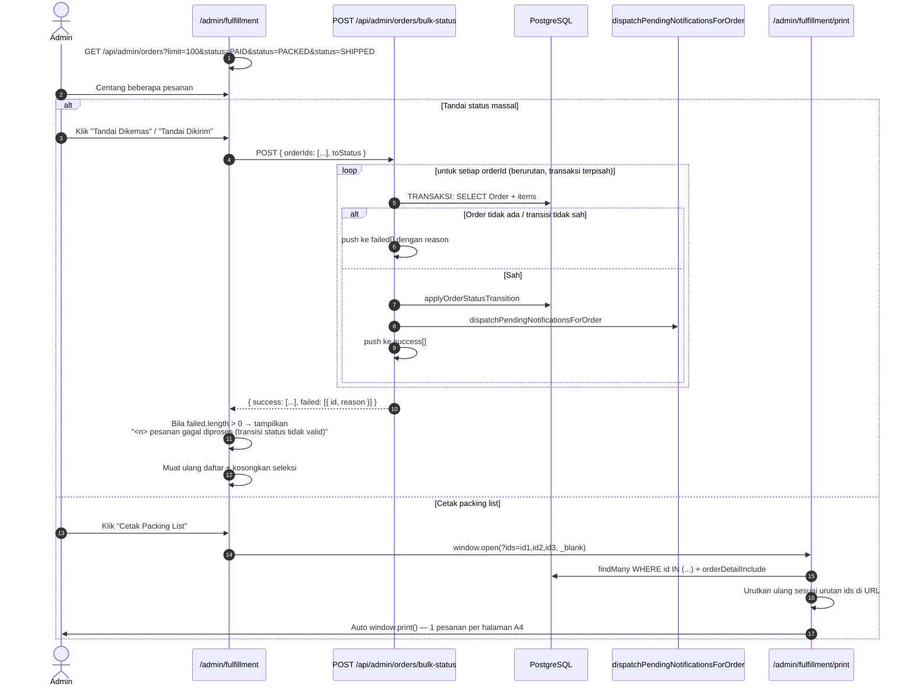
```mermaid
sequenceDiagram
    autonumber
    actor A as Admin
    participant F as /admin/fulfillment
    participant B as POST /api/admin/orders/bulk-status
    participant DB as PostgreSQL
    participant N as dispatchPendingNotificationsForOrder
    participant P as /admin/fulfillment/print

    F->>F: GET /api/admin/orders?limit=100&status=PAID&status=PACKED&status=SHIPPED
    A->>F: Centang beberapa pesanan
    alt Tandai status massal
        A->>F: Klik "Tandai Dikemas" / "Tandai Dikirim"
        F->>B: POST { orderIds: [...], toStatus }
        loop untuk setiap orderId (berurutan, transaksi terpisah)
            B->>DB: TRANSAKSI: SELECT Order + items
            alt Order tidak ada / transisi tidak sah
                B->>B: push ke failed[] dengan reason
            else Sah
                B->>DB: applyOrderStatusTransition
                B->>N: dispatchPendingNotificationsForOrder
                B->>B: push ke success[]
            end
        end
        B-->>F: { success: [...], failed: [{ id, reason }] }
        F->>F: Bila failed.length > 0 → tampilkan<br/>"<n> pesanan gagal diproses (transisi status tidak valid)"
        F->>F: Muat ulang daftar + kosongkan seleksi
    else Cetak packing list
        A->>F: Klik "Cetak Packing List"
        F->>P: window.open(?ids=id1,id2,id3, _blank)
        P->>DB: findMany WHERE id IN (...) + orderDetailInclude
        P->>P: Urutkan ulang sesuai urutan ids di URL
        P->>A: Auto window.print() — 1 pesanan per halaman A4
    end
```

Karakteristik penting:

| Aspek                          | Perilaku                                                                                         |
| ------------------------------ | ------------------------------------------------------------------------------------------------ |
| Batas jumlah                   | Maksimal **100** pesanan per permintaan (`bulkOrderStatusUpdateSchema`)                          |
| Isolasi kegagalan              | Setiap pesanan diproses dalam **transaksi sendiri** — satu kegagalan tidak menggagalkan lainnya  |
| Sukses parsial                 | Selalu `200` dengan array `success` dan `failed`. UI menampilkan jumlah gagal, lalu memuat ulang |
| Notifikasi                     | Dikirim per pesanan yang sukses                                                                  |
| Seleksi setelah filter berubah | Otomatis dikosongkan, agar aksi massal tidak mengenai pesanan yang tidak terlihat                |
| Urutan cetak                   | Mengikuti urutan `ids` di URL, bukan urutan database                                             |

---

## 11. Flow Notifikasi Email

### 11.1 Pola antrean

Notifikasi **tidak** dikirim langsung dari kode bisnis. Polanya selalu:

```
1. Di dalam transaksi bisnis: INSERT Notification { status: 'PENDING', payloadJson }
2. Setelah commit: dispatchNotification(id) atau dispatchPendingNotificationsForOrder(orderId)
```

Alasan pemisahan: kegagalan pengiriman email **tidak boleh** me-rollback pesanan/pendaftaran yang sudah sah, dan pemanggilan API pihak ketiga tidak boleh menahan transaksi database terbuka.

### 11.2 Alur pengiriman

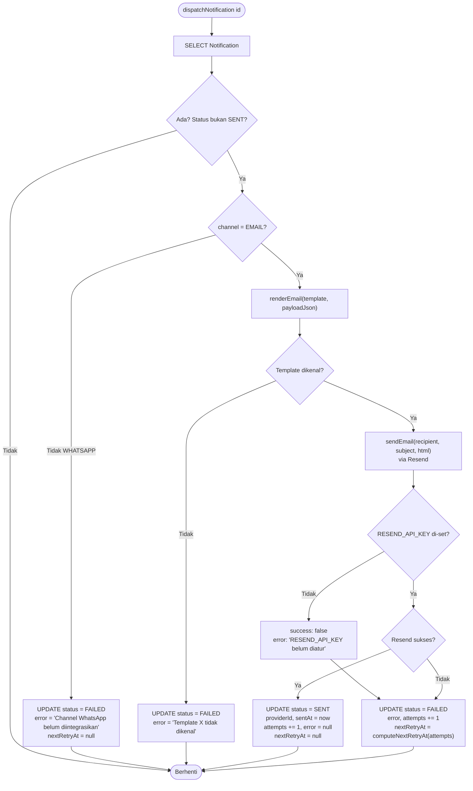
```mermaid
flowchart TD
    A([dispatchNotification id]) --> F[SELECT Notification]
    F --> E1{Ada? Status bukan SENT?}
    E1 -->|Tidak| STOP([Berhenti])
    E1 -->|Ya| CH{channel = EMAIL?}
    CH -->|Tidak WHATSAPP| WF["UPDATE status = FAILED<br/>error = 'Channel WhatsApp belum diintegrasikan'<br/>nextRetryAt = null"] --> STOP
    CH -->|Ya| RD["renderEmail(template, payloadJson)"]
    RD --> TE{Template dikenal?}
    TE -->|Tidak| TF["UPDATE status = FAILED<br/>error = 'Template X tidak dikenal'"] --> STOP
    TE -->|Ya| SD["sendEmail(recipient, subject, html)<br/>via Resend"]
    SD --> KEY{RESEND_API_KEY di-set?}
    KEY -->|Tidak| KF["success: false<br/>error: 'RESEND_API_KEY belum diatur'"] --> FL
    KEY -->|Ya| RS{Resend sukses?}
    RS -->|Ya| OKU["UPDATE status = SENT<br/>providerId, sentAt = now<br/>attempts += 1, error = null<br/>nextRetryAt = null"] --> STOP
    RS -->|Tidak| FL["UPDATE status = FAILED<br/>error, attempts += 1<br/>nextRetryAt = computeNextRetryAt(attempts)"]
    FL --> STOP
```

### 11.3 Jadwal retry

```
MAX_NOTIFICATION_ATTEMPTS = 3
BACKOFF_BASE_MS = 5 menit

computeNextRetryAt(attempts):
  attempts >= 3 → null      (berhenti mencoba, FAILED permanen)
  selain itu    → now + 5 menit × 2^(attempts − 1)
```

| Setelah kegagalan ke- | `attempts` | `nextRetryAt`     |
| --------------------- | ---------- | ----------------- |
| 1                     | 1          | +5 menit          |
| 2                     | 2          | +10 menit         |
| 3                     | 3          | `null` — menyerah |

### 11.4 Pemicu retry

**Cron:** `POST /api/cron/retry-notifications`

```
├─ Bila CRON_SECRET di-set → wajib header Authorization: Bearer <secret>, jika tidak 401
│  Bila CRON_SECRET kosong → endpoint TERBUKA (perhatikan ini di production)
├─ retryFailedNotifications():
│    SELECT Notification WHERE status = 'FAILED'
│                          AND attempts < 3
│                          AND nextRetryAt <= now
│    lalu dispatchNotification untuk masing-masing (paralel, Promise.all)
└─ 200 { retried: <jumlah> }
```

**Manual oleh admin:** `POST /api/admin/notifications/[id]/retry` — mengabaikan `nextRetryAt` dan mencoba segera. Menolak `400` bila status sudah `SENT`.

### 11.5 Daftar template

| Enum `NotificationTemplate` | Subject email                              | Dipicu oleh                                   | Payload                            |
| --------------------------- | ------------------------------------------ | --------------------------------------------- | ---------------------------------- |
| `ORDER_CONFIRMED`           | `Pesanan <no> Diterima`                    | `POST /api/orders` (pembuatan pesanan online) | `orderNumber, receiverName, total` |
| `PAYMENT_RECEIVED`          | `Pembayaran Pesanan <no> Berhasil`         | transisi → `PAID`                             | `orderNumber, receiverName, total` |
| `ORDER_SHIPPED`             | `Pesanan <no> Sudah Dikirim`               | transisi → `SHIPPED`                          | idem (+ `trackingNumber` opsional) |
| `ORDER_COMPLETED`           | `Pesanan <no> Selesai`                     | transisi → `COMPLETED`                        | idem                               |
| `PASSWORD_RESET`            | `Reset Password Gensa Berilmu Store`       | forgot-password & admin reset password member | `resetUrl`                         |
| `AFFILIATE_JOIN`            | `Selamat! Anda Terdaftar Sebagai Afiliasi` | `POST /api/affiliate/join`                    | `name, code`                       |
| `AFFILIATE_PAYOUT`          | `Komisi Afiliasi Anda Telah Dibayarkan`    | `PATCH /api/admin/affiliates/payouts/[id]`    | `name, totalAmount`                |
| `ORDER_PACKED`              | — **tidak ada renderer**                   | **tidak ada** yang mengantrekannya            | —                                  |

Catatan implementasi:

- Ketiga template order (`PAYMENT_RECEIVED`, `ORDER_SHIPPED`, `ORDER_COMPLETED`) diberi payload yang sama oleh `queueOrderNotification`, walau masing-masing template hanya memakai sebagian field. Ini menyederhanakan kode antrean.
- `ORDER_SHIPPED` mendukung `trackingNumber` di templatenya, tetapi tidak ada kolom nomor resi di tabel `Order`, sehingga nilainya selalu kosong.
- Bila `ORDER_PACKED` sampai terantre, `renderEmail` akan mengembalikan `null` dan notifikasi ditandai `FAILED` dengan pesan "Template ORDER_PACKED tidak dikenal".
- Kanal `WHATSAPP` ada di enum tetapi transport-nya belum dibuat; notifikasi WhatsApp langsung `FAILED` **tanpa retry** (`nextRetryAt = null`).

---

## 12. Flow Konfigurasi Tampilan

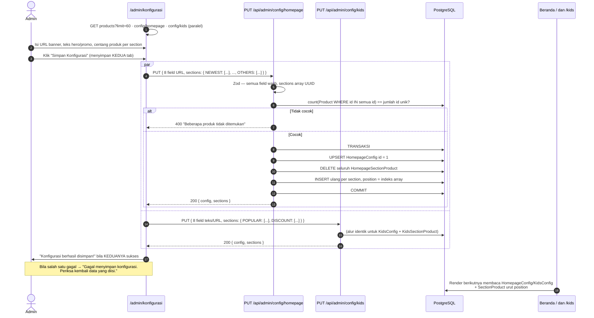
```mermaid
sequenceDiagram
    autonumber
    actor A as Admin
    participant K as /admin/konfigurasi
    participant H as PUT /api/admin/config/homepage
    participant D as PUT /api/admin/config/kids
    participant DB as PostgreSQL
    participant B as Beranda /  dan /kids

    K->>K: GET products?limit=60 · config/homepage · config/kids (paralel)
    A->>K: Isi URL banner, teks hero/promo, centang produk per section
    A->>K: Klik "Simpan Konfigurasi" (menyimpan KEDUA tab)
    par
        K->>H: PUT { 8 field URL, sections: { NEWEST: [...], ..., OTHERS: [...] } }
        H->>H: Zod — semua field wajib, sections array UUID
        H->>DB: count(Product WHERE id IN semua id) == jumlah id unik?
        alt Tidak cocok
            H-->>K: 400 "Beberapa produk tidak ditemukan"
        else Cocok
            H->>DB: TRANSAKSI
            H->>DB: UPSERT HomepageConfig id = 1
            H->>DB: DELETE seluruh HomepageSectionProduct
            H->>DB: INSERT ulang per section, position = indeks array
            H->>DB: COMMIT
            H-->>K: 200 { config, sections }
        end
    and
        K->>D: PUT { 8 field teks/URL, sections: { POPULAR: [...], DISCOUNT: [...] } }
        D->>DB: (alur identik untuk KidsConfig + KidsSectionProduct)
        D-->>K: 200 { config, sections }
    end
    K->>A: "Konfigurasi berhasil disimpan!" bila KEDUANYA sukses
    Note over K,A: Bila salah satu gagal → "Gagal menyimpan konfigurasi.<br/>Periksa kembali data yang diisi."

    B->>DB: Render berikutnya membaca HomepageConfig/KidsConfig<br/>+ SectionProduct urut position
```

### Cara section produk dibaca saat render

Baik `getHomepageData()` maupun `getKidsData()` memakai logika yang sama:

```
1. SELECT <X>SectionProduct WHERE sectionKey = key ORDER BY position ASC
2. Buang produk isActive = false
3. Bila hasilnya ada isinya → pakai
4. Bila kosong               → FALLBACK: 8 produk aktif terbaru (createdAt DESC)
```

Fallback ini membuat halaman **tidak pernah kosong**, baik pada instalasi baru maupun ketika seluruh produk pilihan admin dinonaktifkan.

### Pola delete-all-lalu-insert

Menyimpan konfigurasi **menghapus seluruh** `HomepageSectionProduct` / `KidsSectionProduct` lalu menyisipkan ulang dari nol. Keuntungannya: `position` selalu sama dengan indeks array yang dikirim klien, tanpa perlu logika diff atau reorder. Konsekuensinya: seluruh baris mendapat id baru setiap kali disimpan (tabel ini murni konfigurasi, tidak ada yang mereferensikannya).

---

## 13. Flow Upload Gambar

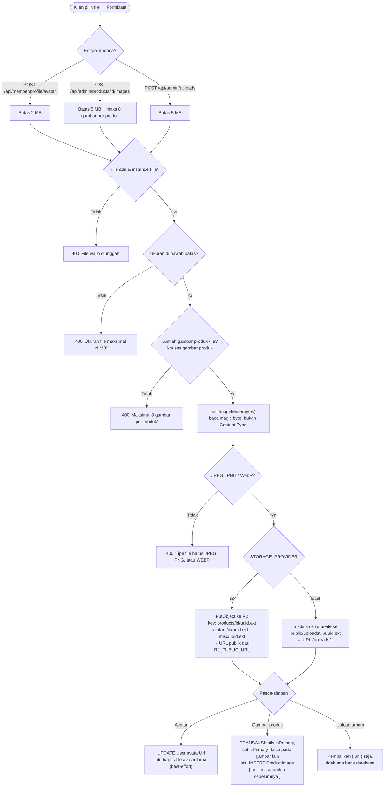
```mermaid
flowchart TD
    A([Klien pilih file → FormData]) --> EP{Endpoint mana?}
    EP -->|POST /api/member/profile/avatar| L1[Batas 2 MB]
    EP -->|POST /api/admin/products/id/images| L2[Batas 5 MB + maks 8 gambar per produk]
    EP -->|POST /api/admin/uploads| L3[Batas 5 MB]

    L1 --> V1{File ada & instance File?}
    L2 --> V1
    L3 --> V1
    V1 -->|Tidak| E1[400 'File wajib diunggah']
    V1 -->|Ya| V2{Ukuran di bawah batas?}
    V2 -->|Tidak| E2[400 'Ukuran file maksimal N MB']
    V2 -->|Ya| V3{Jumlah gambar produk < 8?<br/>khusus gambar produk}
    V3 -->|Tidak| E3[400 'Maksimal 8 gambar per produk']
    V3 -->|Ya| SN["sniffImageMime(bytes)<br/>baca magic byte, bukan Content-Type"]
    SN --> V4{JPEG / PNG / WebP?}
    V4 -->|Tidak| E4[400 'Tipe file harus JPEG, PNG, atau WEBP']
    V4 -->|Ya| ST{STORAGE_PROVIDER}
    ST -->|r2| R2["PutObject ke R2<br/>key: products/id/uuid.ext<br/>avatars/id/uuid.ext · misc/uuid.ext<br/>→ URL publik dari R2_PUBLIC_URL"]
    ST -->|local| LO["mkdir -p + writeFile ke<br/>public/uploads/.../uuid.ext<br/>→ URL /uploads/..."]
    R2 --> PS{Pasca-simpan}
    LO --> PS
    PS -->|Avatar| PA["UPDATE User.avatarUrl<br/>lalu hapus file avatar lama (best-effort)"]
    PS -->|Gambar produk| PP["TRANSAKSI: bila isPrimary,<br/>set isPrimary=false pada gambar lain<br/>lalu INSERT ProductImage<br/>{ position = jumlah sebelumnya }"]
    PS -->|Upload umum| PU["Kembalikan { url } saja,<br/>tidak ada baris database"]
```

### Aturan tambahan

| Aturan                          | Detail                                                                                                                          |
| ------------------------------- | ------------------------------------------------------------------------------------------------------------------------------- |
| Gambar pertama otomatis primary | `isPrimary = (existingImageCount === 0)                                                                                         |     | formData.isPrimary === 'true'` |
| Menghapus gambar primary        | Gambar dengan `position` terkecil otomatis dipromosikan jadi primary                                                            |
| Nama file                       | `randomUUID()` + ekstensi hasil sniffing. Nama asli dari klien **tidak pernah** dipakai                                         |
| Penghapusan file                | Best-effort — file yang sudah tidak ada tidak dianggap error (`try/catch` diam)                                                 |
| Menghapus avatar lama           | Dilakukan **setelah** avatar baru tersimpan dan `User.avatarUrl` diperbarui, agar tidak ada jeda tanpa foto                     |
| Konsistensi urutan gambar       | Semua query membaca gambar dengan `orderBy: [{ isPrimary: 'desc' }, { position: 'asc' }]`, jadi thumbnail selalu gambar primary |
