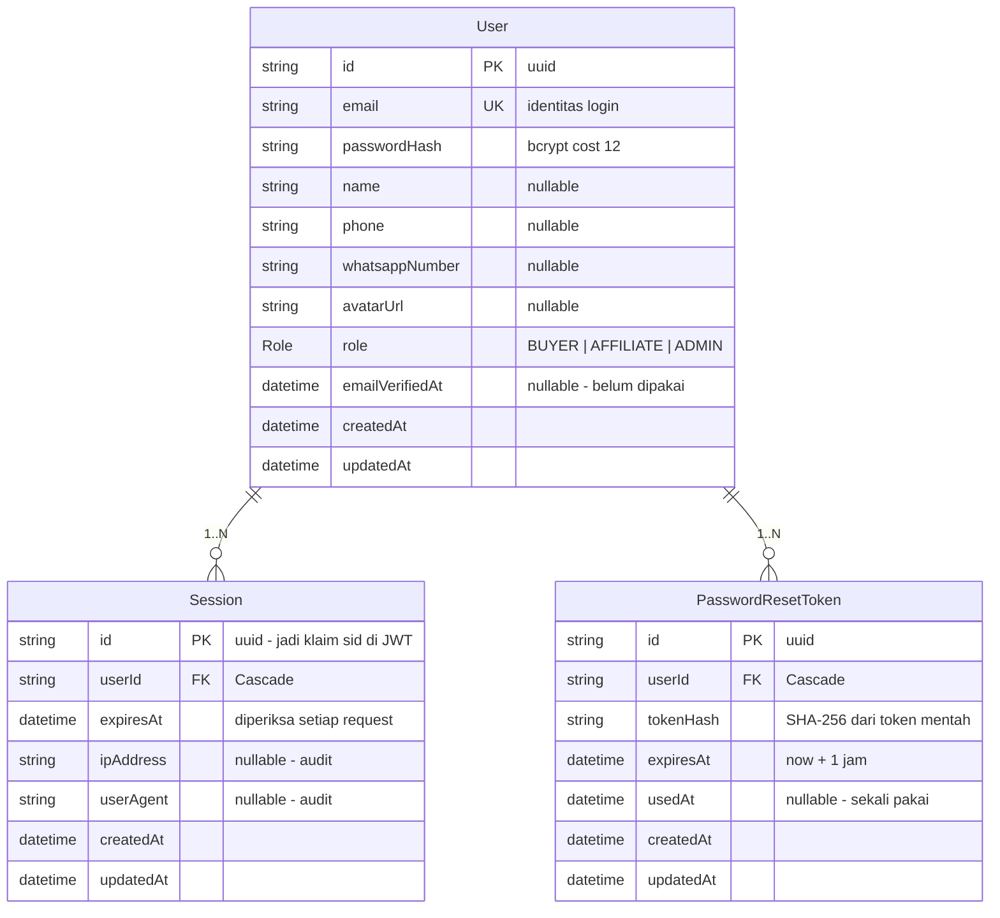
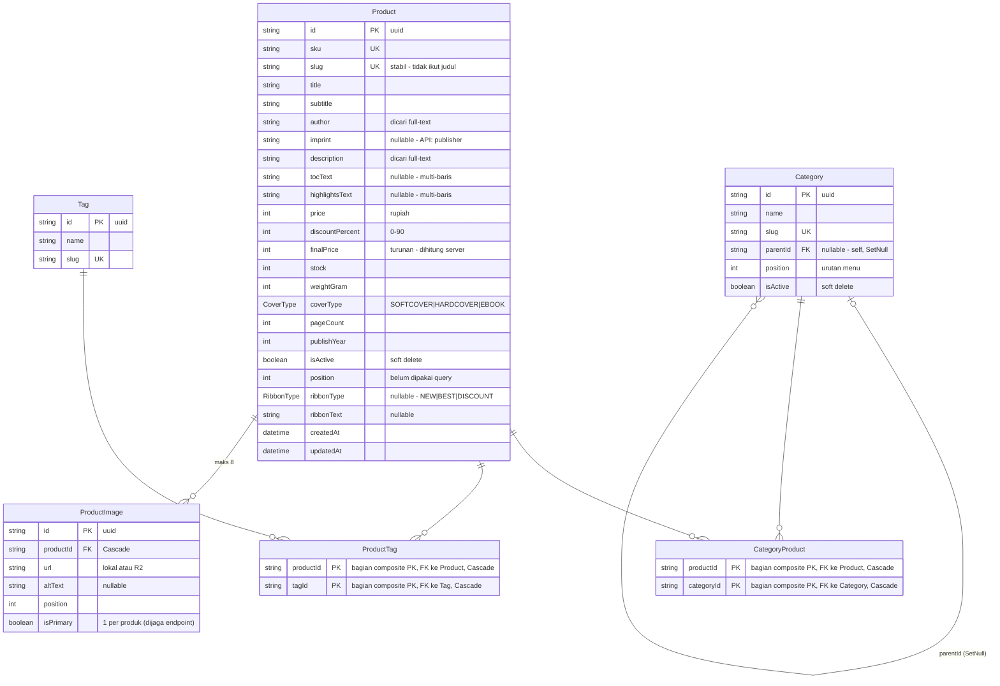
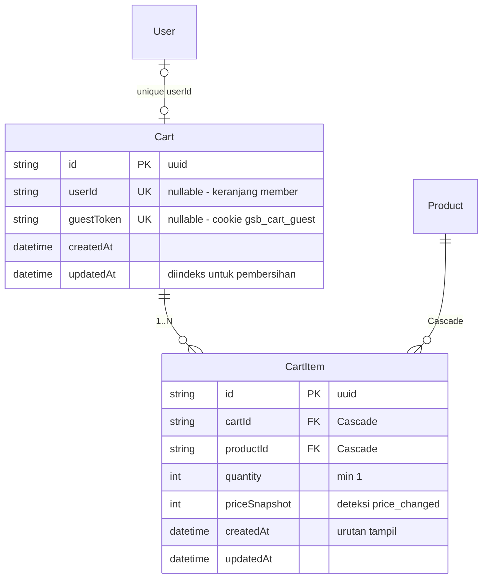
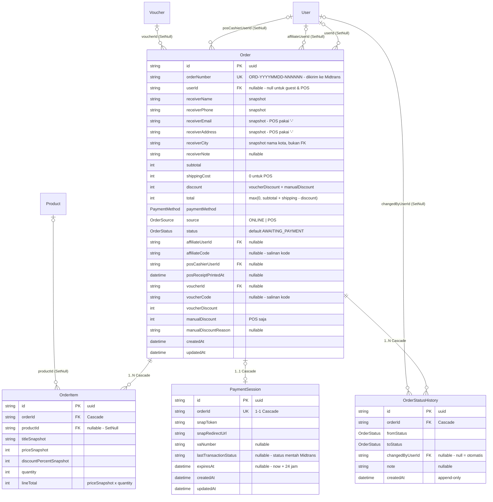
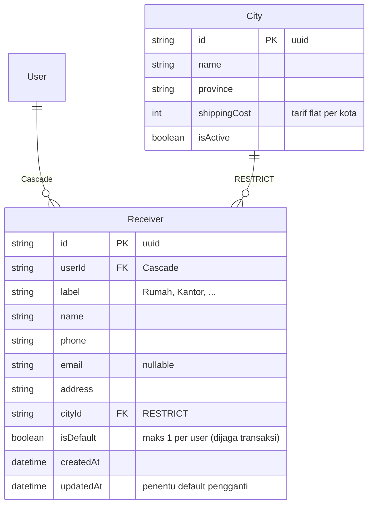
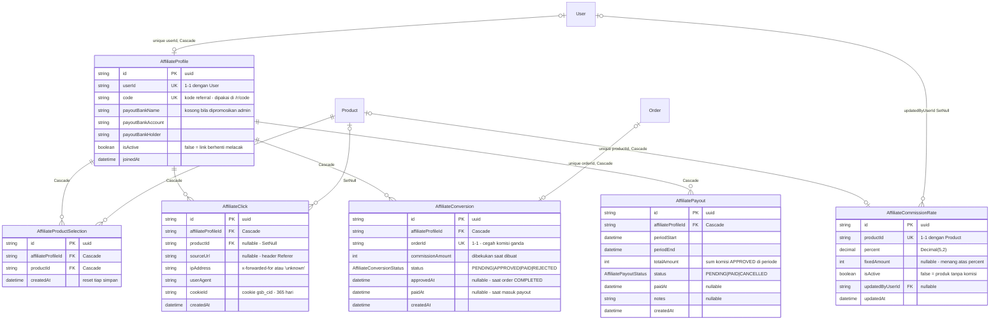
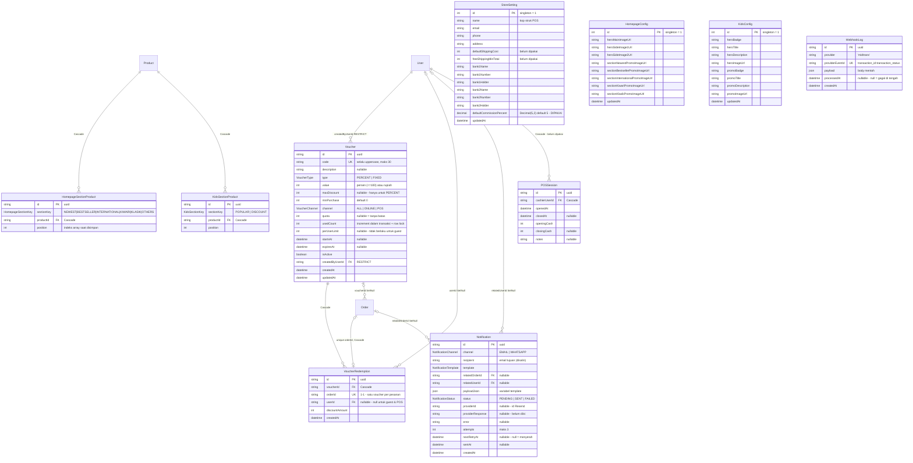

# 08 — ERD (Entity Relationship Diagram)

Diagram dibuat dengan **Mermaid**, yang dirender otomatis di GitHub, GitLab, VS Code (dengan ekstensi Markdown Preview Mermaid), Obsidian, dan [mermaid.live](https://mermaid.live).

Karena skema memiliki 33 tabel, dokumen ini menyajikan:

1. **ERD Global** — semua tabel dan relasinya (tanpa atribut, agar terbaca)
2. **ERD Per Domain** — 7 diagram dengan atribut lengkap
3. **Tabel Semua Relasi** — daftar lengkap FK, kardinalitas, dan aturan `onDelete`
4. **Catatan pembacaan diagram**

Penjelasan fungsi tiap tabel dan kolom ada di [07-tabel-database.md](./07-tabel-database.md).

---

## 1. ERD Global

```mermaid
erDiagram
    User ||--o{ Session : "punya"
    User ||--o{ PasswordResetToken : "punya"
    User |o--o| Cart : "punya"
    User ||--o{ Receiver : "punya"
    User |o--o| AffiliateProfile : "punya"
    User ||--o{ Order : "membeli"
    User ||--o{ Order : "merujuk (afiliasi)"
    User ||--o{ Order : "melayani (kasir POS)"
    User ||--o{ OrderStatusHistory : "mengubah"
    User ||--o{ AffiliateCommissionRate : "memperbarui"
    User ||--o{ POSSession : "membuka shift"
    User ||--o{ Notification : "penerima terkait"
    User ||--o{ Voucher : "membuat"
    User ||--o{ VoucherRedemption : "menukarkan"

    Category |o--o{ Category : "induk-anak"
    Category ||--o{ CategoryProduct : ""
    Product ||--o{ CategoryProduct : ""
    Tag ||--o{ ProductTag : ""
    Product ||--o{ ProductTag : ""
    Product ||--o{ ProductImage : "galeri"
    Product ||--o{ CartItem : ""
    Product ||--o{ OrderItem : ""
    Product |o--o| AffiliateCommissionRate : "tarif komisi"
    Product ||--o{ AffiliateProductSelection : ""
    Product ||--o{ AffiliateClick : ""
    Product ||--o{ HomepageSectionProduct : ""
    Product ||--o{ KidsSectionProduct : ""

    Cart ||--o{ CartItem : "berisi"

    City ||--o{ Receiver : "lokasi"

    Order ||--o{ OrderItem : "berisi"
    Order ||--o{ OrderStatusHistory : "riwayat"
    Order |o--o| AffiliateConversion : "komisi"
    Order |o--o| VoucherRedemption : "penukaran"
    Order |o--o| PaymentSession : "sesi bayar"
    Order ||--o{ Notification : "notifikasi"
    Voucher ||--o{ Order : "dipakai di"

    AffiliateProfile ||--o{ AffiliateProductSelection : "memilih"
    AffiliateProfile ||--o{ AffiliateClick : "menerima klik"
    AffiliateProfile ||--o{ AffiliateConversion : "menghasilkan"
    AffiliateProfile ||--o{ AffiliatePayout : "dibayar via"

    Voucher ||--o{ VoucherRedemption : "ditukarkan"

    StoreSetting {
        int id "singleton = 1"
    }
    HomepageConfig {
        int id "singleton = 1"
    }
    KidsConfig {
        int id "singleton = 1"
    }
    WebhookLog {
        string providerEventId "unique - idempotensi"
    }
```



Empat tabel di bagian bawah (`StoreSetting`, `HomepageConfig`, `KidsConfig`, `WebhookLog`) **tidak memiliki relasi FK apa pun** — tiga yang pertama adalah singleton konfigurasi, yang terakhir adalah log webhook yang berdiri sendiri.

---

## 2. ERD Per Domain

### 2.1 Domain Autentikasi & Pengguna



### 2.2 Domain Katalog Produk



### 2.3 Domain Keranjang



Constraint yang menjaga invarian: `Cart.userId` unique, `Cart.guestToken` unique, dan `CartItem[cartId, productId]` unique.

### 2.4 Domain Pesanan (inti)



### 2.5 Domain Pengiriman & Alamat



`Restrict` pada `cityId` adalah satu-satunya `Restrict` selain `Voucher.createdByUser`. Kota yang masih dipakai alamat tersimpan tidak boleh dihapus, dan endpoint admin membalas `409` dengan pesan yang jelas.

Perhatikan bahwa `Order` **tidak** punya FK ke `Receiver` — pesanan menyimpan salinan datar, sehingga mengubah/menghapus alamat tidak mempengaruhi pesanan lama.

### 2.6 Domain Afiliasi



Perhatikan **tidak ada FK** dari `AffiliateConversion` ke `AffiliatePayout`. Keterkaitannya implisit: `affiliateProfileId` + rentang `periodStart..periodEnd` + `status = PAID`. Bila kelak butuh pelacakan eksak "konversi ini masuk batch mana", perlu menambahkan kolom `payoutId` pada `AffiliateConversion`.

### 2.7 Domain Voucher, Notifikasi, Konfigurasi & POS



---

## 3. Tabel Semua Relasi

### 3.1 Relasi one-to-one (1—1)

| Induk     | Anak                      | Kolom FK    | Constraint | onDelete  | Makna                                                  |
| --------- | ------------------------- | ----------- | ---------- | --------- | ------------------------------------------------------ |
| `User`    | `Cart`                    | `userId`    | `@unique`  | `Cascade` | Satu member = satu keranjang tetap                     |
| `User`    | `AffiliateProfile`        | `userId`    | `@unique`  | `Cascade` | Satu user maksimal satu profil afiliasi                |
| `Product` | `AffiliateCommissionRate` | `productId` | `@unique`  | `Cascade` | Satu produk maksimal satu tarif komisi                 |
| `Order`   | `AffiliateConversion`     | `orderId`   | `@unique`  | `Cascade` | Satu pesanan maksimal satu komisi (cegah komisi ganda) |
| `Order`   | `VoucherRedemption`       | `orderId`   | `@unique`  | `Cascade` | Satu pesanan maksimal satu voucher                     |
| `Order`   | `PaymentSession`          | `orderId`   | `@unique`  | `Cascade` | Satu pesanan satu sesi Snap (di-`upsert`)              |

### 3.2 Relasi one-to-many (1—N)

| Induk              | Anak                        | Kolom FK             | onDelete       | Catatan                                    |
| ------------------ | --------------------------- | -------------------- | -------------- | ------------------------------------------ |
| `User`             | `Session`                   | `userId`             | `Cascade`      |                                            |
| `User`             | `PasswordResetToken`        | `userId`             | `Cascade`      |                                            |
| `User`             | `Receiver`                  | `userId`             | `Cascade`      |                                            |
| `User`             | `Order`                     | `userId`             | `SetNull`      | relasi `OrderToUser` — pembeli             |
| `User`             | `Order`                     | `affiliateUserId`    | `SetNull`      | relasi `OrderToAffiliateUser` — perujuk    |
| `User`             | `Order`                     | `posCashierUserId`   | `SetNull`      | relasi `OrderToPosCashierUser` — kasir     |
| `User`             | `OrderStatusHistory`        | `changedByUserId`    | `SetNull`      | null = perubahan otomatis                  |
| `User`             | `AffiliateCommissionRate`   | `updatedByUserId`    | `SetNull`      | audit siapa mengubah tarif                 |
| `User`             | `POSSession`                | `cashierUserId`      | `Cascade`      | tabel belum dipakai                        |
| `User`             | `Notification`              | `relatedUserId`      | `SetNull`      |                                            |
| `User`             | `Voucher`                   | `createdByUserId`    | **`Restrict`** | admin pembuat voucher tidak bisa dihapus   |
| `User`             | `VoucherRedemption`         | `userId`             | `SetNull`      | null untuk guest & POS                     |
| `Category`         | `Category`                  | `parentId`           | `SetNull`      | self-relation; anak naik jadi root         |
| `Category`         | `CategoryProduct`           | `categoryId`         | `Cascade`      |                                            |
| `Tag`              | `ProductTag`                | `tagId`              | `Cascade`      |                                            |
| `Product`          | `ProductImage`              | `productId`          | `Cascade`      |                                            |
| `Product`          | `ProductTag`                | `productId`          | `Cascade`      |                                            |
| `Product`          | `CategoryProduct`           | `productId`          | `Cascade`      |                                            |
| `Product`          | `CartItem`                  | `productId`          | `Cascade`      | keranjang sementara                        |
| `Product`          | `OrderItem`                 | `productId`          | `SetNull`      | pesanan permanen — snapshot tetap          |
| `Product`          | `AffiliateProductSelection` | `productId`          | `Cascade`      |                                            |
| `Product`          | `AffiliateClick`            | `productId`          | `SetNull`      | log klik tetap ada                         |
| `Product`          | `HomepageSectionProduct`    | `productId`          | `Cascade`      |                                            |
| `Product`          | `KidsSectionProduct`        | `productId`          | `Cascade`      |                                            |
| `Cart`             | `CartItem`                  | `cartId`             | `Cascade`      |                                            |
| `City`             | `Receiver`                  | `cityId`             | **`Restrict`** | kota terpakai tidak bisa dihapus           |
| `Order`            | `OrderItem`                 | `orderId`            | `Cascade`      |                                            |
| `Order`            | `OrderStatusHistory`        | `orderId`            | `Cascade`      |                                            |
| `Order`            | `Notification`              | `relatedOrderId`     | `SetNull`      |                                            |
| `Voucher`          | `Order`                     | `voucherId`          | `SetNull`      | `voucherCode` tetap sebagai salinan        |
| `Voucher`          | `VoucherRedemption`         | `voucherId`          | `Cascade`      | alasan voucher terpakai tidak bisa dihapus |
| `AffiliateProfile` | `AffiliateProductSelection` | `affiliateProfileId` | `Cascade`      |                                            |
| `AffiliateProfile` | `AffiliateClick`            | `affiliateProfileId` | `Cascade`      |                                            |
| `AffiliateProfile` | `AffiliateConversion`       | `affiliateProfileId` | `Cascade`      |                                            |
| `AffiliateProfile` | `AffiliatePayout`           | `affiliateProfileId` | `Cascade`      |                                            |

### 3.3 Relasi many-to-many (N—N)

| Kiri      | Kanan      | Tabel pivot       | Primary key               | Kolom tambahan |
| --------- | ---------- | ----------------- | ------------------------- | -------------- |
| `Product` | `Category` | `CategoryProduct` | `[productId, categoryId]` | tidak ada      |
| `Product` | `Tag`      | `ProductTag`      | `[productId, tagId]`      | tidak ada      |

Kedua pivot memakai composite primary key (bukan `id` sintetis) karena tidak punya atribut sendiri. Ini sekaligus mencegah duplikat tanpa index tambahan.

Relasi N—N lain yang **tidak** memakai pivot murni karena punya atribut sendiri:

- `AffiliateProfile` ↔ `Product` lewat `AffiliateProductSelection` (punya `id` + `createdAt`)
- `Product` ↔ section beranda/kids lewat `HomepageSectionProduct` / `KidsSectionProduct` (punya `position`)

### 3.4 Tabel tanpa relasi FK

| Tabel            | Alasan                                                                    |
| ---------------- | ------------------------------------------------------------------------- |
| `StoreSetting`   | Singleton konfigurasi global (id = 1)                                     |
| `HomepageConfig` | Singleton konfigurasi global (id = 1)                                     |
| `KidsConfig`     | Singleton konfigurasi global (id = 1)                                     |
| `WebhookLog`     | Log mandiri; tertaut ke pesanan hanya lewat `payload.order_id` (bukan FK) |

---

## 4. Catatan Pembacaan Diagram

### Notasi kardinalitas Mermaid yang dipakai

| Notasi      | Artinya                                                      |
| ----------- | ------------------------------------------------------------ |
| `\|\|--o{`  | Tepat satu di kiri, nol atau lebih di kanan (1—N wajib)      |
| `\|o--o{`   | Nol atau satu di kiri, nol atau lebih di kanan (FK nullable) |
| `\|o--o\|`  | Nol atau satu di kedua sisi (1—1 opsional)                   |
| `\|\|--o\|` | Tepat satu di kiri, nol atau satu di kanan (1—1)             |

### Kenapa `User` muncul tiga kali menuju `Order`

Prisma mewajibkan nama relasi eksplisit bila dua model terhubung lebih dari sekali. Ketiga peran itu:

| Nama relasi Prisma      | Kolom              | Peran                                  |
| ----------------------- | ------------------ | -------------------------------------- |
| `OrderToUser`           | `userId`           | pembeli (null untuk guest & POS)       |
| `OrderToAffiliateUser`  | `affiliateUserId`  | afiliasi yang merujuk pembelian        |
| `OrderToPosCashierUser` | `posCashierUserId` | admin/kasir yang membuat transaksi POS |

Satu pesanan POS bisa punya `posCashierUserId` terisi sementara `userId` null. Satu pesanan online lewat link afiliasi punya `userId` dan `affiliateUserId` terisi (dan bisa saja keduanya user yang berbeda).

### Kolom snapshot yang sengaja bukan FK

Beberapa nilai disalin datar alih-alih dijadikan foreign key, agar dokumen historis tidak berubah saat data referensinya berubah:

| Tabel          | Kolom snapshot                                                                      | Menggantikan FK ke |
| -------------- | ----------------------------------------------------------------------------------- | ------------------ |
| `Order`        | `receiverName`, `receiverPhone`, `receiverEmail`, `receiverAddress`, `receiverCity` | `Receiver`, `City` |
| `Order`        | `affiliateCode`                                                                     | `AffiliateProfile` |
| `Order`        | `voucherCode`                                                                       | `Voucher`          |
| `OrderItem`    | `titleSnapshot`, `priceSnapshot`, `discountPercentSnapshot`                         | `Product`          |
| `Notification` | `recipient`                                                                         | `User.email`       |

Sebagian di antaranya tetap **punya** FK berdampingan dengan salinannya (`voucherId` + `voucherCode`, `affiliateUserId` + `affiliateCode`, `productId` + `titleSnapshot`). FK dipakai untuk join dan pelaporan; salinan dipakai agar baris tetap bermakna setelah induknya hilang (`SetNull`).

### Cara meng-generate ulang diagram

Bila skema berubah, diagram di dokumen ini perlu diperbarui manual. Alternatifnya, generator otomatis dari `prisma/schema.prisma`:

```bash
# Contoh: prisma-erd-generator (belum dipasang di proyek ini)
pnpm add -D prisma-erd-generator @mermaid-js/mermaid-cli
# lalu tambahkan generator di prisma/schema.prisma dan jalankan prisma generate
```

Untuk saat ini, sumber kebenaran tetap `prisma/schema.prisma`; dokumen ini adalah representasi terbacanya.
